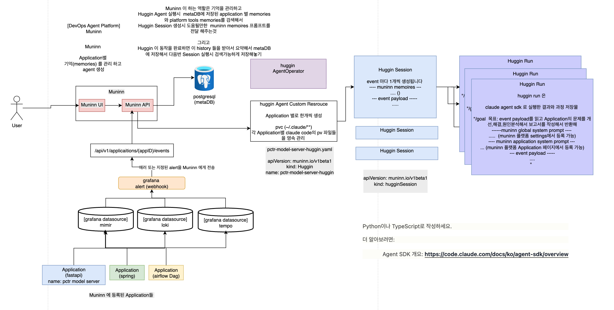

# Muninn DevOps Agent Platform

> 인프라 알림(Grafana/Airflow/ArgoCD)이 Claude 에이전트를 깨워 문제를 진단하고 **PR/Issue 를 여는** 이벤트 기반 플랫폼.

> **📘 문서 사이트**: <https://kimsoungryoul.github.io/muninn/> — 설계서·가이드·레퍼런스를 한곳에서. (`muninnDocs/` 에서 빌드, main 푸시 시 자동 배포)

오딘의 두 까마귀에서 이름을 따온 두 평면으로 구성된다.

| 까마귀 | 평면 | 책임 |
|--------|------|------|
| **Huginn** (사고 / thought) | Agent Plane | 이벤트를 받아 Claude Code 에이전트를 실행하고, 진단하고, PR/Issue 를 생성한다. |
| **Muninn** (기억 / memory) | Memory Plane + 콘솔 | 지식 recall/store, 운영자 UI/API, metaDB. |

이 저장소는 **독립적으로 빌드되는 3개 컴포넌트 + 권위 있는 설계서**로 이루어진 모노레포다.



## 아키텍처 — 이벤트가 PR 이 되기까지

CRD 계층(`muninn.io/v1beta1`)을 따라 제어 흐름이 이어진다.

```
event ─▶ Muninn API (정규화 + dedup) ─▶ HuginnIssue CR
   ─▶ HuginnIssue 컨트롤러가 HuginnRun(attempt N) 생성
   ─▶ HuginnRun 컨트롤러가 K8s Job → Pod (agent-runtime 이미지) 생성
   ─▶ Pod 가 claude_skill.sh → claude-agent-sdk 루프 실행 ─▶ PR / GitHub Issue
                                          │
                                          └─▶ recall(Muninn) · loki/tempo/mimir/github 조사 + 기억 저장
```

- **`HuginnAgent`** = 운영 대상 앱 1개(=에이전트 정의, the "Application").
- **`HuginnIssue`** = 이벤트 1건.
- **`HuginnRun`** = 실행 1회.

Operator 는 **Job 만 생성**한다. 에이전트 프로세스와 Muninn API 가 진행 상황을 `HuginnRun.status` 에 되써 보고한다.

> **구현됨**: dedup + 이벤트 인입 내구성(인입 즉시 metaDB `inbound_event` 영속 → 동일 fingerprint 활성 Issue 면 새 Issue 대신 `dedupCount` 증가), 워크스페이스=네임스페이스 멀티테넌시 admission, HITL 승인 루프 E2E(runner ↔ 승인 폴링), OIDC/토큰 인증 계층(메인 스펙 §4.4/§6.1/§6.4/§6.6).
> **남은 후속**: severity gate 동적화(현재 `warning` 하드코딩), 원본 payload Secret 격리, 재처리 워커, SQL RLS·NetworkPolicy egress·workspace 멤버십 검증, 승인 만료 자동집행 데몬.

## 저장소 구성

| 경로 | 무엇 | 스택 |
|------|------|------|
| [`huginnOperator/`](./huginnOperator/) | CRD 라이프사이클을 소유하는 K8s operator | Go, kubebuilder / controller-runtime |
| [`huginnAgentRuntime/`](./huginnAgentRuntime/) | 에이전트 실행 1회마다 도는 컨테이너 이미지 | Dockerfile + `claude_skill.sh` + Python (`claude-agent-sdk`) |
| [`muninnWeb/`](./muninnWeb/) | 운영자 콘솔 + **Muninn API**(게이트웨이·메모리) + CopilotKit 코파일럿 | Next.js (App Router) |
| [`deploy/helm/muninn/`](./deploy/helm/muninn/) | operator + web 배포용 Helm chart (PostgreSQL 외부) | Helm |
| [`docs/design/`](./docs/design/) | **권위 있는 설계서** — 코드 주석이 `§` 섹션을 인용 | Markdown + 예시 CR |
| [`muninnDocs/`](./muninnDocs/) | 문서 사이트(GitHub Pages) — `docs/design/` 을 동기화해 정적 빌드 | Next.js (Nextra 4), pnpm |

> 설계의 source of truth 는 [`docs/design/muninn-devops-agent-platform.md`](./docs/design/muninn-devops-agent-platform.md)(메인 설계서)와 [`docs/design/operator-design.md`](./docs/design/operator-design.md)(operator 시맨틱)다. operator 동작을 바꾸기 전에 `operator-design.md` 를 먼저 읽어라 — 코드 주석이 `§2.2`, `§5.1` 처럼 섹션 번호로 참조한다.

## Quick start

### 로컬 풀스택 — `make run-local` (루트)

루트 `Makefile` 이 monorepo 전역 작업을 모은다. 한 줄로 kind 클러스터를 만들고 세 이미지를
로컬 빌드해 적재한 뒤, Helm 으로 플랫폼 전체(operator + web + metaDB)를 클러스터 **안** 에 띄운다.

```bash
make run-local                      # kind 생성 → 이미지 3종 빌드/적재 → metaDB → helm install (Podman 기본)
# (선택) 자격이 있으면 코파일럿/agent 까지 활성화:
CLAUDE_CODE_OAUTH_TOKEN=... make run-local
make status                         # 배포 상태
make down                           # kind 클러스터 삭제(정리)
```

> `huginnOperator` 의 `make run-kind` 와 다르다: `run-kind` 는 operator 를 클러스터 **밖**(host `go run`)으로
> 띄우는 빠른 컨트롤러 개발 루프이고, `run-local` 은 operator 까지 helm 으로 클러스터 **안** 에 배포한다.

루트 Makefile 은 하위 프로젝트로 위임하는 일관 어휘(`build`·`image`·`lint`·`test`)도 노출한다 —
`make images` 는 세 이미지를 모두 빌드하고, `make build`/`make lint` 는 각 프로젝트로 fan-out 한다.
전체 타깃은 `make help`.

### huginnOperator (Go)

```bash
cd huginnOperator
make build                 # manager 바이너리 빌드
make test                  # unit + envtest (Ginkgo/Gomega; etcd/kube-apiserver 다운로드)
make manifests generate    # api/*_types.go 또는 +kubebuilder 마커 수정 후 필수
make run                   # 현재 kubeconfig 로 컨트롤러 실행 (로컬은 ENABLE_WEBHOOKS=false)
```

로컬 end-to-end (kind, Podman 권장):

```bash
make run-kind CONTAINER_TOOL=podman   # kind 생성 + CRD 설치 + agent-runtime 이미지 빌드/load + operator 실행
make test-e2e                          # 격리된 kind e2e (별도 클러스터)
make kind-delete CONTAINER_TOOL=podman
```

### huginnAgentRuntime (이미지 — Podman, not Docker)

```bash
cd huginnAgentRuntime
make image        # = podman build -t ghcr.io/kimsoungryoul/muninn/agent-runtime:dev .
make selftest     # 오프라인 배선 점검(API 호출 없음). make test 도 동일.
```

CI 는 `.github/workflows/agent-runtime-image.yml` 로 이미지를 발행한다(PR = 빌드만, main/tag push = 멀티아치 push).

### muninnWeb (Next.js, port 3030 — pnpm)

```bash
cd muninnWeb
make install       # = pnpm install --frozen-lockfile
make dev           # http://localhost:3030
make build         # production 빌드 = 타입체크 게이트 (tsc 실행). make test 도 동일.
make lint
make image         # = podman build -t ghcr.io/kimsoungryoul/muninn/muninn-web:dev .
```

> ⚠️ `make dev` 가 도는 중에 `make build` 를 돌리지 말 것 — `.next` 가 손상된다.

> 코파일럿(CopilotKit) 동작엔 자격 env 가 필요하다: `CLAUDE_CODE_OAUTH_TOKEN` 또는 `ANTHROPIC_API_KEY`. (선택) `COPILOT_MODEL` 로 모델 override(기본 `claude-haiku-4-5-20251001`).

> **주요 운영 env (muninnWeb / runtime)** — 모두 선택(미설정 시 dev/기본 동작):
> - 인증: `MUNINN_API_TOKEN`(에이전트→API 정적 Bearer), `MUNINN_OIDC_ISSUER`/`MUNINN_OIDC_AUDIENCE`/`MUNINN_OIDC_JWKS_URI`(사람용 콘솔 OIDC; JWKS_URI 생략 시 issuer 의 `.well-known/jwks.json`).
> - 데이터/멀티테넌시: `DATABASE_URL`(외부 postgres), `MUNINN_WORKSPACE`(메모리 기본 워크스페이스 — operator 가 Run 에 주입; 워크스페이스=네임스페이스).
> - 승인(runtime/web): `MUNINN_REQUIRE_APPROVAL`(런너 승인 게이트 on), `MUNINN_APPROVAL_TTL_MINUTES`(승인 만료, 기본 90), `MUNINN_APPROVAL_TIMEOUT`(런너 폴링 timeout 초, 기본 1800), `MUNINN_APPROVAL_POLL_SECONDS`(폴링 주기, 기본 10).

### muninnDocs (문서 사이트, port 3031 — pnpm)

```bash
cd muninnDocs
make install       # = pnpm install --frozen-lockfile
make dev           # http://localhost:3031 — 기동 전에 docs/design/ → content/design/ 자동 동기화
make build         # 정적 export(out/) + pagefind 검색 인덱스
```

> 설계 문서 수정은 항상 [`docs/design/`](./docs/design/) 원본에서 — `content/design/` 은 빌드 시 생성되는 사본(gitignore)이다. main 푸시 시 `.github/workflows/docs-site.yml` 이 GitHub Pages 로 자동 배포한다.

### 배포 (Helm)

```bash
helm install muninn deploy/helm/muninn -n muninn --create-namespace
```

operator + web 을 설치한다. **PostgreSQL 은 chart 가 설치하지 않는다** — `externalPostgresql.*` 로 외부 인스턴스 연결 정보만 등록한다. webhook(기본 off)을 켜면 [cert-manager](https://cert-manager.io)가 필요하다. 자세한 값/사전 요구는 [chart README](./deploy/helm/muninn/README.md) 참고.

## 기여자가 알아야 할 핵심 계약

- **상태 필드 소유권(`HuginnRunStatus`) — 위반 금지.** 필드가 3명의 writer 로 나뉜다(`operator-design.md §2.2`): Operator 는 `phase`/`startedAt`/`finishedAt`/`jobName`/caps/`conditions`; Agent→API 는 `step`/`cost`/`tokens`/`output`; API 는 `AwaitingApproval` 전이 + `approval`. 그래서 operator 는 full update 가 아니라 `r.Status().Patch(ctx, run, client.MergeFrom(base))` 로 status 를 쓴다 — 다른 writer 필드를 덮어쓰지 않도록.
- **재시도는 pod 레벨이 아니다.** Job 은 `backoffLimit=0` 으로 생성된다. 재시도는 `HuginnIssue` 컨트롤러가 *새 attempt* `HuginnRun` 을 만드는 방식이며 `retryPolicy.maxRuns` 로 제한된다. 에이전트 런은 비멱등이므로 pod restart 를 절대 켜지 마라.
- **`JobTemplate` 은 큐레이트된 slim 서브셋**(full PodSpec 아님). full `corev1.PodSpec` 을 넣으면 CRD OpenAPI 스키마가 client-side-apply 256KB 한도를 넘는다. `buildJobTemplate` 가 slim recipe 를 채우고, `expandPodSpec` 가 고정 필드(restartPolicy=Never, `~/.claude` 볼륨 마운트, non-root securityContext 등)를 더해 실제 PodSpec 을 만든다.
- **agent-runtime 이미지 계약.** **non-root**(`node`, uid 1000)로 돈다 — `claude` CLI 가 root 에서 `--dangerously-skip-permissions` 를 거부하기 때문. `~/.claude` 는 `/home/node/.claude`(operator 의 `claudeMountPath` 와 일치해야 함). 엔트리는 `claude_skill.sh`(모드: `run` / `selftest`), `runner.py` 가 `claude-agent-sdk` 를 구동하고 SDK 가 `PATH` 의 `claude` CLI 를 띄운다 — 따라서 npm CLI 와 Python SDK 둘 다 필요.
- **에이전트 자격은 env(Secret) 전용.** operator 가 `agent-secrets` Secret 에서 `ANTHROPIC_API_KEY`·`CLAUDE_CODE_OAUTH_TOKEN`(둘 다 optional, 런타임은 최소 하나 필요), 앱의 `source.secretRef` Secret(키 `token`)에서 `GITHUB_PAT` 를 주입한다. 이미지·매니페스트·web mock 에 자격증명을 절대 넣지 마라. `SELFTEST` 센티넬(`ANTHROPIC_API_KEY=SELFTEST` 또는 `MUNINN_SELFTEST=1`)로 실제 키 없이 파이프라인 QA 가능.
- **Muninn API 인증은 2계층(`lib/auth.ts`).** 사람용 콘솔(승인/거절/위임)은 **OIDC JWT**, 에이전트→API(보고·메모리)는 **정적 토큰**. `requireAuth` 우선순위는 **OIDC(jose JWKS 검증, `MUNINN_OIDC_ISSUER`/`MUNINN_OIDC_AUDIENCE`/`MUNINN_OIDC_JWKS_URI`) > 정적 토큰(`MUNINN_API_TOKEN`, timing-safe) > dev 허용**. 둘 다 같은 `Authorization: Bearer` 헤더를 쓰되 JWT 형태로 구분한다(OIDC·토큰 둘 다 미설정이면 dev 모드 허용). **승인/거절은 CopilotKit server tool 에서 제외** — 콘솔 전용(`/api/runs/[id]/approve|reject`)으로 격리한 자율 승인 게이트.
- **워크스페이스 = 네임스페이스 (멀티테넌시 경계).** HuginnAgent validating webhook 이 `spec.workspaceId == metadata.namespace` 를 강제(불일치/빈 값 거부, immutable). operator 가 Run Job 에 `MUNINN_WORKSPACE` 를 주입(`muninn.io/workspace` 라벨 우선, 누락 시 `run.Namespace` 폴백)하고, 메모리(`memory.workspace` 컬럼)는 store/recall/list 가 workspace 로 필터한다. (RLS·NetworkPolicy·멤버십 검증은 후속.)
- **이벤트 인입 내구성 + dedup.** `POST /api/hooks/{app}` 는 인입 즉시 metaDB `inbound_event` 에 영속(best-effort)하고, `muninn.io/event-fingerprint` 라벨로 활성 HuginnIssue 를 조회해 동일 fingerprint 활성 Issue 면 새 Issue 대신 `status.dedupCount` 를 증가시킨다. (severity gate 동적화·payload Secret·재처리 워커는 후속.)
- **muninnWeb 은 dual-mode(콘솔 + Muninn API + 메모리) — 비영속 mock 이 아니다.** 배선되면 `app/api/**` 라우트가 **실제 동작**을 한다: 실 `HuginnIssue`/`HuginnRun` CR 을 생성·patch 하고(`@kubernetes/client-node`, `lib/k8s.ts`), 외부 **postgres**(Drizzle, `lib/db.ts`)에 메모리를 저장·recall 한다(텍스트 검색 `to_tsvector`/`ts_rank_cd`, pgvector 없음). 라우트는 `k8sEnabled()`/`dbEnabled()` 로 분기하고, 미배선이면 `lib/data.ts`(`HM_DATA`) mock 으로 폴백한다(마이그레이션 진행 중). ⚠️ **`POST /api/hooks/{app}`·`POST /api/issues` 는 무해한 mock 이 아니다** — k8s 가 배선된 환경에서 호출하면 실제 agent Job 이 떠 실 API 비용이 발생할 수 있다. 상태변경 라우트(보고·승인·위임·webhook)는 `MUNINN_API_TOKEN` 이 설정되면 `Authorization: Bearer` 를 요구한다(`lib/auth.ts`).

## 컨벤션

- **Podman, not Docker** — 전반적으로 컨테이너 런타임은 Podman(kind 는 `KIND_EXPERIMENTAL_PROVIDER=podman`; operator make 타깃엔 `CONTAINER_TOOL=podman`).
- **회사 식별 정보 금지** — org/repo/host 이름은 중립 placeholder(`acme` 등) 사용.
- **kubebuilder 생성 파일은 손대지 말 것** (`config/crd/bases/*`, `config/rbac/role.yaml`, `**/zz_generated.*`, `PROJECT`) — `make manifests generate` 로 재생성. 자세한 kubebuilder 메커니즘은 [`huginnOperator/AGENTS.md`](./huginnOperator/AGENTS.md).
- **네이밍** — 아키텍처 그림의 오타 `huggin`/`hugginSession` 은 **Huginn** 으로 정규화. 이벤트 CR 은 Claude SDK 의 "session" 과 혼동을 피해 `HuginnIssue`. Kinds: `HuginnAgent` / `HuginnIssue` / `HuginnRun`.
- 아키텍처 다이어그램 원본은 `muninn아키텍처.drawio`(원본 설계 + "현재 구현" 2페이지), `muninnAgentPlatform_architecture.png` 는 렌더 스냅샷.

전체 개발 가이드는 [`CLAUDE.md`](./CLAUDE.md), 설계 상세는 [`docs/design/`](./docs/design/) 참고.

## 라이선스

See repository for license details.
