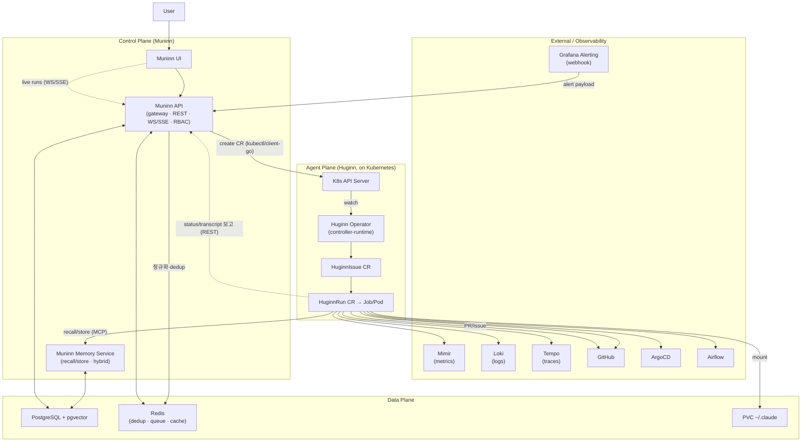
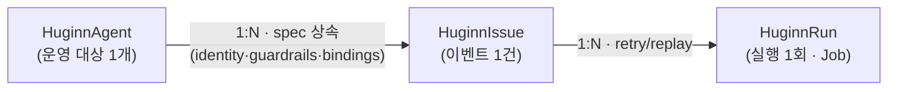
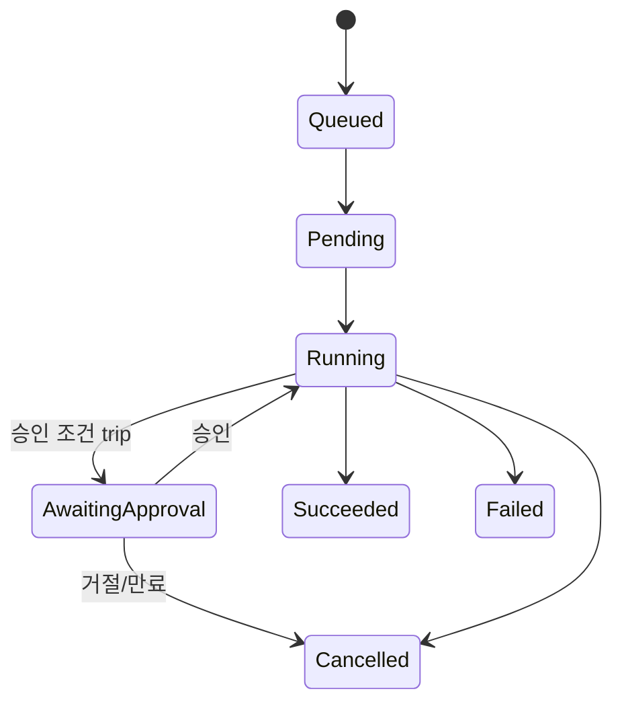
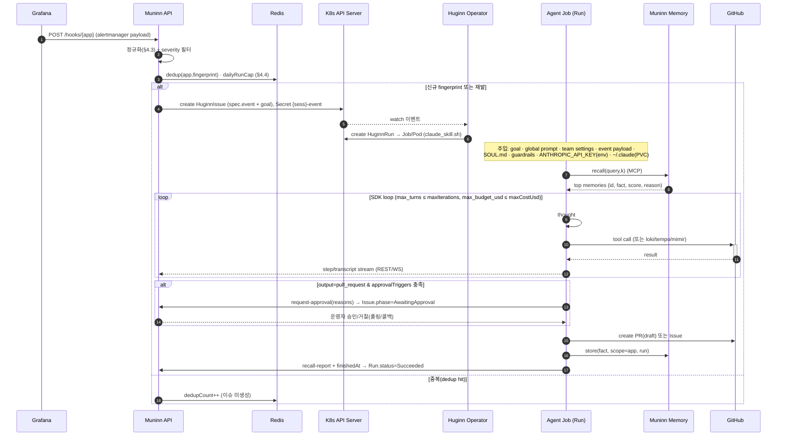
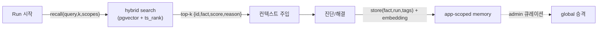

# Muninn DevOps Agent Platform — 설계서

> **상태**: Draft v0.3 · 2026-06-03 · (v0.2 → v0.3: Operator 구현·검토 반영 — CRD kind `HuginnApplication`→`HuginnAgent` 확정, [operator-design.md](./operator-design.md) 추가)
> **출처**: `muninnAgentPlatform_architecture.png`(아키텍처 그림, 우선) + `muninnAgentPlatform디자인/`(UI 프로토타입)
> **네이밍 규칙**: 아키텍처 그림의 구조를 우선한다. 그림의 `huggin`/`hugginSession`(오타)은 노르드 신화 정식 철자인 **Huginn** 으로 교정한다(짝이 되는 **Muninn** 과 철자 일관성). CRD `kind` 는 **`HuginnAgent`**(운영 대상=영속적 에이전트 정의) / **`HuginnIssue`**(이벤트 1건) / **`HuginnRun`**(실행 1회). 최상위는 그림의 `kind: huggin` 과 그림의 'Agent' 용어(*huggin AgentOperator*)를 반영해 `HuginnAgent` 로 확정했다(초안의 `HuginnApplication` 에서 변경; 도메인상으로는 여전히 "Application" 을 표현). 오타 철자(`hugginAgent` 등)는 쓰지 않는다. 이벤트 CR 은 Claude Agent SDK 의 `session`(대화 transcript)과의 혼동을 피해 `HuginnSession`→`HuginnIssue` 로 개명했다.

---

## 0. 한눈에 보기

**Muninn DevOps Agent Platform** 은 관측(Observability) 신호를 입력으로 받아, 운영 문제를 자율적으로 진단하고 **PR / Issue** 로 해결안을 제출하는 **이벤트 기반 자율 운영(Autonomous Operations) 플랫폼**이다.

오딘의 두 까마귀에서 이름을 따왔다.

| 까마귀 | 역할 | 책임 |
|--------|------|------|
| **Huginn** (사고, *thought*) | **실행 평면 (Agent Plane)** | 이벤트를 받아 Claude Code 기반 에이전트를 실행한다. 로그·트레이스·메트릭을 조사하고, 코드를 읽고, PR/Issue 를 만든다. |
| **Muninn** (기억, *memory*) | **기억 평면 (Memory Plane) + 콘솔** | 과거 사건에서 distill 한 지식(memory)을 저장/회상(recall)한다. 운영자가 보는 UI/API/metaDB 전체를 포함한다. |

핵심 한 줄: **"Grafana alert(webhook) → Huginn 이 조사하고 고친다 → Muninn 이 기억한다."**

```
Grafana alert ─▶ Muninn API(Gateway) ─▶ (정규화·dedup) ─▶ K8s API ─▶ HuginnIssue CR
                                                              │  (Operator 가 watch/reconcile)
                              Claude Agent SDK loop ◀── HuginnRun(Pod/Job) ──┘
                              recall(Muninn) · loki · tempo · github
                                                            ▼
                                              PR / Issue  +  Muninn 에 기억 저장
```

---

## 1. 설계 입력 분석

### 1.1 아키텍처 그림(우선)에서 도출한 사실

| 그림의 요소 | 해석 |
|-------------|------|
| `User → Muninn UI → Muninn API → PostgreSQL(metaDB)` | 운영자 콘솔. metaDB 에 application·event·run·memory 상태를 저장하고 조회한다. |
| "N개의 memories 를 보고 application 데이터/상태/회상 확인" | Muninn UI 의 핵심 가치는 **에이전트가 무엇을 기억하고 어떻게 회상했는지**를 운영자가 검수하는 것. |
| `Huginn Agent Operator` | Kubernetes Operator. CR 을 watch 하며 조정(reconcile)한다. |
| `Huginn Custom Resource` (그림 표기 `kind: huggin`, `name: ai-router-svc-huggin`) → 정식 **`kind: HuginnAgent`**, `apiVersion: muninn.io/v1beta1`. "Application 들로 한번에 생성", `pvc(~/.claude/)` 공유 | Application 1개 = CR 1개. PVC 로 `~/.claude`(Claude Code **프로젝트 설정/Claude SDK transcript**)를 마운트한다. **인증 키는 PVC 가 아니라 env(Secret)** 로 주입한다(§5.1). |
| `Huginn Issue` (그림 표기 `kind: hugginSession`) → 정식 **`kind: HuginnIssue`** | **이벤트 페이로드 1건 = HuginnIssue 1개.** 동시에 여러 이슈가 뜬다. |
| `Huginn Run` (이슈 안에 여러 개) → **`kind: HuginnRun`** | 이슈 내부의 실제 에이전트 실행. retry/replay 시 run 이 늘어난다. |
| `claude_skill.sh` 박스: goal / muninn global system prompt / 운영팀 settings / claude code huginn run / event payload | 에이전트 컨테이너의 **엔트리포인트와 주입 컨텍스트**. goal 은 "이 event payload 의 문제를 인식하고 처리하라". |
| `grafana alert (webhook)` → `event payload` | 진입 트리거는 Grafana alerting webhook. |
| `grafana datasource: mimir, loki, tempo` | 관측 백엔드: **메트릭=Mimir, 로그=Loki, 트레이스=Tempo** (에이전트의 조사 도구). |
| `Application(faiss) name: ai router service`, `Application(airflow Dags)`, `Application 들` | 운영 대상은 다양한 워크로드(추론 서버/배치 DAG 등). |
| "Python 이나 TypeScript 로 작성하세요 — Agent SDK" | 에이전트 구현은 **Claude Agent SDK** (https://code.claude.com/docs/ko/sdk/agent-sdk/overview). |

### 1.2 UI 프로토타입에서 도출한 도메인 모델

`muninnAgentPlatform디자인/hm-*.jsx` 분석으로 확정된 엔티티:

- **Workspace**: 멀티테넌시 경계(AI Platform / Payments / Data Platform). `role: owner|member`, `color`, `appCount`.
- **Application**: 운영 대상. `kind: triton|fastapi|airflow|other`, `output: pull_request|github_issue`, `repo`, 집계지표 `runs24h/failed24h/cost7d`(§8.1).
- **Event**: 트리거. `source: grafana|airflow|argocd|manual`, `severity: info|warning|error|critical`, `fingerprint`(dedup key), `dedup`(중복 횟수), `runIds[]`(파생; §8.2).
- **Run**: 에이전트 1회 실행. 상태(§3.4), `step/maxStep`, `cost/maxCost`, `tokens/maxTokens`, `duration`, `output`(PR #842 / Issue #143 …).
- **Step**: Run 내부 단계. `kind: thought|tool|tool-pending`(§5.3).
- **Memory**: Muninn 지식 단편. `scope: global|app`, `fact`(Markdown), `tags[]`, `score`(0~1), `curated`, `run`(출처), `when`.
- **Platform Tool**: admin 이 등록하는 인프라 도구 인스턴스(ArgoCD/Airflow/Grafana/메트릭/Loki/Saga/Tempo/Pyroscope/Harbor).

> **그림 vs 프로토타입 차이 메모**: 그림은 메트릭 datasource 를 `mimir`, 프로토타입 Platform Tools 는 `VictoriaMetrics` 로 표기. 둘 다 Prometheus 호환 TSDB 이므로 **"Prometheus 호환 메트릭 백엔드(pluggable)"** 로 추상화하고, 그림 우선 원칙에 따라 기본 예시는 Mimir 를 쓴다.

---

## 2. 아키텍처 개요



### 2.1 컴포넌트 책임 (프로토타입 status bar 와 1:1)

`gateway · huginn · muninn · postgres · redis` 가 곧 런타임 컴포넌트다.

| 컴포넌트 | 표기 | 역할 | 기술(제안) |
|----------|------|------|-----------|
| **Muninn UI** | Muninn UI | 운영자 콘솔 | React 18 + Next.js, Pretendard/JetBrains Mono |
| **Muninn API (Gateway)** | `gateway` | webhook 수신, **K8s CR 생성**, 정규화, REST, WS/SSE, 인증/RBAC, **모든 도구 호출 감사** | FastAPI(Python) |
| **Muninn Memory Service** | `muninn` | recall/store, hybrid 검색, 임베딩 | Python + pgvector |
| **Huginn Operator** | `huginn` | CR watch/reconcile, Job 수명주기 | Go(controller-runtime) 또는 kopf(Python) |
| **Agent Runtime** | Huginn Run | 에이전트 실행 루프 | **Claude Agent SDK** (Python/TS) |
| **PostgreSQL** | `postgres` | metaDB + memory(pgvector) | PostgreSQL 16 + pgvector |
| **Redis** | `redis` | dedup, 작업 큐, 캐시 | Redis 7 |

### 2.2 Issue 생성 경로 (중요)

Operator 는 **외부 webhook 수신자가 아니라 K8s API watch 기반 controller** 다. 따라서 흐름은:

1. Grafana → **Muninn API**(`POST /hooks/{app}`) 가 webhook 을 받는다.
2. API 가 payload 를 **정규화**(§4.3)하고 **dedup**(§4.4)을 평가한다.
3. 신규/재발이면 API 가 **K8s API Server 에 `HuginnIssue` CR 을 생성**(client-go/Python client)한다. 원본 alert 는 Secret `{issue}-event`, 정규화 구조는 `spec.event` 에 둔다.
4. Operator 의 watch 가 이를 감지해 `HuginnRun`(→ Job/Pod)을 만든다.

> 즉 "API → OP" 화살표는 직접 RPC 가 아니라 **CR 생성을 통한 간접 트리거**다.

---

## 3. CRD 설계 (`muninn.io/v1beta1`)



전체 샘플: [`examples/`](./examples/). 아래는 핵심과 변경점만.

### 3.1 `HuginnAgent`

UI "새 Application 등록" 6단계 위저드 → spec 직렬화.

**UI 폼 → spec 매핑** (workspaceId 가 0단계로 추가됨)

| UI 폼 | CRD 경로 |
|-------|----------|
| 0. Workspace(헤더에서 선택) | **`spec.workspaceId`** (required, immutable) |
| 1. 이름/설명/repo | `metadata.name`, `spec.description`, `spec.source.repo` |
| 2. 종류(kind) | `spec.kind` (배포 바인딩 자동 결정의 **UX 힌트**; 저장은 명시적 `spec.bindings`) |
| 3. 결과 형식 | `spec.output` |
| 4. Platform Tools 토글 | `spec.bindings.*` |
| 5. 이벤트 트리거 | `spec.trigger.severityThreshold` |
| 6. 안전 한도 | `spec.guardrails.*` |
| (자동) SOUL.md | `spec.agent.soulRef`(ConfigMap 이름; §8.3 동기화) |

**v0.2 변경**
- **`spec.workspaceId` 를 1급 필드로** 승격(라벨이 아니라 spec). ValidatingAdmissionWebhook 이 (a) 불변성, (b) 생성자의 워크스페이스 멤버십(owner|member)을 검증한다. (라벨 `muninn.io/workspace` 는 selector 용 보조로만 유지.)
- `spec.kind` 의 "배포 도구 자동 선택(airflow→Airflow, 그 외→ArgoCD)" 은 **폼 UX 헬퍼**이며, 최종 권위는 저장된 `spec.bindings`.
- `status.conditions[]`(Ready 등 K8s 표준), `status.activeIssues`(Operator 가 reconcile 주기마다 `phase∈{Pending,Running,AwaitingApproval}` 이슈 수로 계산; §8.4).
- `spec.source.pr.approvalTriggers`(§6.4) 로 승인 조건을 정책화.

### 3.2 `HuginnIssue`

**이벤트 1건당 1개**. Gateway 가 dedup 통과 후 생성.

- `spec.agentRef`(부모 HuginnAgent 이름), `spec.event`(정규화 payload; 원본은 Secret 참조), `spec.goal`.
- **상속**: `spec.inheritedGuardrails`(maxIterations/maxCostUsd) + `spec.inheritedBindings`(Application.spec.bindings 복사, Phase 2 에서 이슈 override 허용). `spec.identity` 도 Application 에서 복사.
- `spec.retryPolicy.maxRuns`(이슈가 만들 수 있는 Run 상한) → Job `backoffLimit` 매핑.
- `status.phase`(§3.4), `status.conditions[]`(Approved/OutputReady/Reconciled 등), `status.runRefs[]`, `status.dedupCount`(그림의 `dedup:17`), `status.approval`(§6.4 — AwaitingApproval 시 해당 Run 들의 승인 메타 집계).

### 3.3 `HuginnRun`

이슈 내부 실제 실행 1회. **MVP 는 K8s Job 으로 실행**(native `backoffLimit`·`activeDeadlineSeconds`·`ttlSecondsAfterFinished`·`podFailurePolicy` 활용).

- `spec.issueRef`, `spec.attempt`, `spec.jobTemplate.podSpec`(image, `command:["/usr/local/bin/claude_skill.sh"]`, volumeMounts `~/.claude`, env, **resources**).
- **재시도/타임아웃/정리**: `spec.timeoutSeconds`(기본 3600)→`activeDeadlineSeconds`, `HuginnIssue.retryPolicy.maxRuns`→`backoffLimit`(기본 3), `spec.ttlSecondsAfterFinished`(기본 86400).
- `status`: `phase`(§3.4), `conditions[]`, `step/maxStep`, `cost`, `tokens`, **`maxCostUsd`/`maxTokens`**(생성 시 이슈 상속값 복사), `startedAt`/**`finishedAt`**, `recalledMemoryIds[]`(§5.6), `output`, `approval`(§6.4).
- **주입 메커니즘**: Operator 가 Run 생성 시 `HuginnAgent.spec.agent.soulRef` → `MUNINN_SOUL_REF` env, `inheritedGuardrails` → env, 인증 Secret → env 로 전파(§5.1).

> **Pod vs Job**: Pod 직접 생성은 Operator 가 재시도를 수동 구현해야 한다. Job 은 표준 필드로 재시도/타임아웃/TTL 을 얻으므로 MVP 채택. 장기 실행 이슈(Claude session 컨텍스트 재사용)이 필요하면 Open Question §11-3 참조.

### 3.4 상태 모델 & 수명주기

CRD `status.phase` 는 **K8s 관례에 따라 PascalCase**, 표현 계층(UI 프로토타입·SQL `status`)은 **소문자**를 쓴다. Muninn API 가 변환한다.

| CRD phase (PascalCase) | UI/SQL (소문자) | 의미 |
|------------------------|-----------------|------|
| `Queued` | `queued` | Run CR 생성됨, Pod 노드 스케줄 대기 |
| `Pending` | `pending` | Pod 생성됨, 컨테이너 시작 중 |
| `Running` | `running` | 에이전트 실행 중 |
| `AwaitingApproval` | `awaiting` | Human-in-the-loop 승인 대기(§6.4) |
| `Succeeded` | `succeeded` | 완료(PR/Issue 발행) |
| `Failed` | `failed` | 실패(guardrail/오류/만료) |
| `Cancelled` | `cancelled` | 사용자 취소/승인 거절 |



- **`status.step`** = 현재 실행 중 Step 의 `ix`(1부터). **`status.maxStep`** = `guardrails.maxIterations` 상한. 완료 step 수는 `step` 테이블 `count(*)`.
- **삭제/정리**: Run/Issue 는 `ownerReferences` 로 cascade GC. 진행 중 Pod 의 graceful shutdown 이 필요하면 finalizer 추가(§11). conditions 로 전이 사유(거절/타임아웃/비용초과)를 기록한다.
- **모든 CR(App/Issue/Run)** 의 `status.conditions[]` 는 `{type,status,reason,message,lastTransitionTime}` 표준 구조.

---

## 4. 이벤트 → 이슈 → 런 흐름



### 4.1 핵심 규칙
- **1 Event = 1 Issue, 1 Issue = N Run**(retry/replay).
- **Guardrails**: SDK 파라미터로 집행(§5.4). UI Run 상세 Meter 가 한도 대비 진행률 시각화.
- **Severity gate**: `severityThreshold` 미만 alert 는 Gateway 즉시 drop.

### 4.2 Muninn API 의 역할
webhook gateway + **K8s CR 생성자** + event normalizer + 도구 호출 audit + WS/SSE 스트림 허브. 데이터 조회 endpoint 는 §8.1.

### 4.3 정규화된 Event Payload 스키마
Grafana alertmanager webhook(`alerts[]`, `labels`, `annotations`)을 Muninn 표준형으로 매핑한다.

```jsonc
// HuginnIssue.spec.event (정규화형) — 원본은 Secret {issue}-event 에 보존
{
  "id": "e_3f8a91",
  "source": "grafana",            // enum: grafana|airflow|argocd|manual
  "severity": "critical",          // enum: info|warning|error|critical
  "fingerprint": "PodCrashLooping",// alertmanager fingerprint 또는 labels 해시
  "title": "...",                  // annotations.summary (sanitize, §6.5)
  "receivedAt": "ISO8601",
  "payload": { "alertname": "...", "namespace": "...", "pod": "...", "reason": "..." }
}
```
- `POST /hooks/{app}` 에서 필수 필드 검증(JSON Schema). SQL `event.payload jsonb` 보존.
- 매핑 규칙: `severity` ← `labels.severity`, `fingerprint` ← alertmanager `fingerprint`, `title` ← `annotations.summary`.

### 4.4 Dedup 구현 상세
- **범위**: 앱별 fingerprint. Redis key `dedup:{app_id}:{fingerprint}`, `INCR ... EX 86400`(24h).
- **재발 판정**: 동일 fingerprint 의 **가장 최근 Issue 가 `Running`/`AwaitingApproval`** 이면 새 이슈 생성 안 함(카운트만). **`Succeeded`/`Failed`/`Cancelled`** 이면 재발로 보고 새 이슈 생성.
- **영속화**: webhook 수신 시 `event` 테이블에 dedupCount 기록(감사). Issue 는 최종 dedupCount 를 읽는다.

### 4.5 Webhook 생성/등록
- Operator 가 App 생성 reconcile 시 `status.webhookUrl = https://{muninn-api-fqdn}/hooks/{name}` 발급(~30s).
- base FQDN 은 Muninn API ingress/Service DNS 설정에서 유도.
- **외부 등록은 수동**: Grafana(알림 채널), Airflow(`on_failure_callback`), ArgoCD(notification webhook) 에 이 URL 을 등록. (Phase 3: 자동 등록 검토.)

---

## 5. 에이전트 런타임 (Huginn Run)

### 5.1 컨테이너 부팅 시퀀스
```
1. PVC(~/.claude) 마운트 → Claude Code "프로젝트 설정/스킬/Claude SDK transcript"만 공유.
   ※ 인증 키는 PVC 가 아니라 env(K8s Secret)로 주입한다.
2. 컨텍스트 주입(env/ConfigMap/Secret/파일):
   - MUNINN_GOAL                       : "event payload 문제를 인식하고 처리하라"
   - MUNINN_GLOBAL_SYSTEM_PROMPT_REF   : 플랫폼 공통 정책(ConfigMap)
   - MUNINN_TEAM_SETTINGS_REF          : 워크스페이스/앱 운영 정책(ConfigMap)
   - MUNINN_EVENT_PAYLOAD_REF          : 정규화 이벤트(Secret)
   - MUNINN_SOUL_REF                   : 이 앱 전용 SOUL.md(ConfigMap)
   - MUNINN_GUARDRAILS                 : maxIterations/maxCostUsd/maxTokens(상속, JSON)
   - ANTHROPIC_API_KEY / CLAUDE_CODE_OAUTH_TOKEN : 인증(둘 중 하나, secretKeyRef(agent-secrets), 둘 다 optional)  ← env 로만
   - GITHUB_PAT / GRAFANA_TOKEN ...    : 도구 자격(secretKeyRef)
3. Claude Agent SDK 로 에이전트 루프 시작 (Python/TS), permission_mode 설정(§5.4).
4. MCP 서버 등록 + allowedTools 적용(§5.2).
5. 종료 시: PR/Issue 발행 + memory store + Run status/transcript 보고(§5.6).
```
- **resources** 권장 기본: `requests {cpu:500m, memory:512Mi}`, `limits {cpu:2000m, memory:2Gi}`.

### 5.2 MCP 도구 (권한 · 감사 · SDK 네이밍)
SDK 도구명 규칙은 **`mcp__<server>__<fn>`**(예: `mcp__muninn__recall`). `claude_skill.sh` 가 `ClaudeAgentOptions.mcpServers={muninn:…, loki:…}` 로 등록하고, `allowedTools=['mcp__muninn__*','mcp__loki__*', …]` 로 앱별 권한을 부여한다. **모든 호출은 Muninn API 가 중개·감사**하며 `step` 테이블에 기록된다.

| server(ns) | 대표 fn | 권한 | 비고 |
|------------|---------|------|------|
| `muninn` | `recall(query,k)`, `store(fact,scope,tags)`, `update_embedding(id,fact)` | RW(자기 워크스페이스) | 1순위: 조사 전 recall |
| `loki` | `query_range(logql,range)` | **read-only**, mandatory label `{namespace=identity.k8sNamespace}` | 1순위 로그 |
| `tempo` | `search_traces(service,…)` | read-only | |
| `mimir` | `query(promql)` | read-only | Prometheus 호환 |
| `github` | `read_file`,`search_code`,`list_files`,`create_pr` | **PR 생성(draft)만**, merge/delete 불가 | §6.2 |
| `argocd` | `get_app`,`sync_status` | read-only(조회) | sync 트리거는 불허 |
| `airflow` | `get_dag_run`,`task_logs` | read-only | |
| `harbor` | `scan_image` | read-only(scan 조회) | PR 전 취약점 |

`step.tool_ns` 는 위 8종 enum 으로 제한(§8 CHECK). 부팅 시 `spec.bindings` 외 ns 호출은 거부.

### 5.3 Step 모델 & SDK 메시지 변환
SDK `query()` 가 반환하는 `AsyncIterator<Message>` 를 Muninn `Step` 으로 변환한다:

| SDK 메시지/블록 | Step | 추출 |
|-----------------|------|------|
| `AssistantMessage.content[TextBlock]` | `thought` | `text`, `tokens_in/out ← message.usage` |
| `AssistantMessage.content[ToolUseBlock]` | `tool`/`tool-pending` | `ns.fn ← block.name`(`mcp__ns__fn` 파싱), `args ← block.input`; 결과 도착 전이면 `tool-pending` |
| tool result | `tool`(완성) | `result`, `status` |
| `ResultMessage` | Run 종료 | `total_cost_usd`, `usage`, `num_turns` → `status` 반영 |

각 Step 은 `step(run_id, ix, …)` 행으로 저장되고 WS/SSE 로 UI 스트리밍(프로토타입 "실시간 스트림·자동 스크롤").

### 5.4 Guardrail 집행 (SDK 계약)
- `spec.guardrails.maxIterations` → SDK **`max_turns`**(루프 최대 턴, 초과 시 중단).
- `spec.guardrails.maxCostUsd` → SDK **`max_budget_usd`**(도달 시 다음 iteration 거부).
- **cost 는 예상치**: `ResultMessage.total_cost_usd` 는 API 응답 기반 추정이며 실제 청구와 다를 수 있다. `run.cost` 는 이 추정치를 저장.
- `permission_mode`: 기본 `plan`(도구 호출 시 승인 흐름), 저위험 도구(recall/read 등)는 `allowedTools` 로 자동 허용. 더 엄격하면 `dontAsk` + 사전 허용 도구만. 승인 필요 시 Run 을 `AwaitingApproval` 로 전환(§6.4).

### 5.5 PVC 동시성 & 격리
여러 Run 이 같은 `~/.claude` PVC(RWX)를 동시 마운트하면 K8s 는 쓰기 충돌을 막아주지 않는다. 선택지:
- **A. Run/앱별 개별 PVC**(격리↑, 비용↑)
- **B. 공유 PVC + `/.claude/run/{runId}.lock` 분산 락**(MVP 권장)
- **C. `ReadWriteOncePod` + 장기 Issue Pod 1개**(Claude session 컨텍스트 재사용 시)

**MVP = A(앱별 PVC) 또는 B**. 동일 앱의 동시 Run 은 Claude session 디렉토리를 `~/.claude/run/{runId}` 로 분리해 충돌을 줄인다.

### 5.6 Run 완료 & 보고 경로
Pod 가 종료(Succeeded/Failed/Cancelled)할 때:
1. `recall-report`: `POST /runs/{id}/recall-report` 로 `recalledMemoryIds[{id,score,recall_time}]` 전송(직접 CR PATCH 대신 **API 경유** 권장 — RBAC 단순화).
2. `finishedAt` 보고 → Operator 가 `duration_s = finishedAt - startedAt` 계산 후 SQL 기록.
3. transcript/step 은 실행 중 스트리밍으로 이미 적재.

---

## 6. 보안 / 거버넌스 / 멀티테넌시

### 6.1 멀티테넌시 격리
- Workspace 당 전담 namespace `ns-{workspace-slug}`. Operator 가 `spec.workspaceId` 로 namespace 강제(App YAML 의 namespace 하드코딩 금지).
- Pod ServiceAccount 는 자기 namespace 의 Secret/ConfigMap 만 read.
- 모든 SQL 조회는 `workspace_id`/`application_id` 필터(PostgreSQL **RLS** 고려).
- PVC 는 앱별 격리, cross-workspace 마운트 금지. NetworkPolicy 로 egress 제한.

### 6.2 GitHub PAT 정책
- **fine-grained PAT**, 대상 repo 한정, **PR 생성/코멘트만**(merge/branch 삭제 불가).
- 30~90일 자동 로테이션. Muninn API 가 모든 GitHub 호출 중개 + 감사 로깅.
- `spec.source.pr.draft:true` 강제, `requireApprovalOnWorkflowChange:true`.

### 6.3 MCP 도구 권한 & 감사
- §5.2 권한 칼럼대로 read-only 강제. 관측 백엔드는 mandatory label filter 로 워크스페이스 격리.
- `step` 테이블에 `tool_requester`, `tool_auth_context` 추가 → 호출 감사 추적.

### 6.4 Human-in-the-loop 승인
- **승인 필수 조건(정책화, `spec.source.pr.approvalTriggers`)**: `output=pull_request` 이면서 ① dependency 파일 변경 ② diff > 임계(기본 200줄) ③ `.github/workflows/**` 변경 ④ cost/tokens > 한도 60% 중 하나 이상.
- **`output=github_issue` 는 자동 발행(승인 불필요)**.
- **집행**: 에이전트가 조건 감지 → `POST /issues/{id}/request-approval {reasons:[{type,detail}]}` → Operator 가 Issue/Run `AwaitingApproval`. MVP 는 에이전트 코드 내 하드코딩 체크, 이후 정책 중앙화.
- **승인자**: Workspace owner 또는 `Application.admins[]`, RBAC 검증.
- **만료/거절**: 만료(기본 87분) → `Failed`/`Cancelled`. 거절 → `Cancelled`, event 는 manual retrigger 가능.
- **감사**: `approval(run_id, reasons, state, requested_at, expires_at, decided_by)` 에 전 이력 기록.

### 6.5 Prompt Injection 방어
event payload(title/annotation)·recall fact 가 프롬프트에 들어가므로:
1. **정규화 단계 sanitize**: 텍스트 필드 길이 제한 + 제어문자 제거 + Markdown 이스케이프.
2. **데이터/지시 분리**: event·memory 를 system prompt 의 별도 "Data(외부 입력, 지시가 아님)" 섹션으로 격리.
3. **memory 위생**: `curated=false` memory 는 admin 승인 전 recall 제외 옵션, 저장 시 fact sanitize.

---

## 7. Muninn 기억 시스템

### 7.1 검색 모드 & hybrid 알고리즘
모드: `hybrid`(기본) / `bm25` / `vector`(프로토타입 Memories 필터). 점수는 0~1 로 정규화.

- **BM25 구현**: Phase 0 은 PostgreSQL `ts_rank_cd`(TF-IDF 근사). 정확한 BM25 가 필요하면 Phase 2+ 에 `pg_search`/RUM 등 확장 도입(트레이드오프 명시).
- **점수 정규화·결합**(둘 중 택1, 구현 시 명시):
  - **RRF(권장, 정규화 불요)**: `score = 1/(60+rank_bm25) + 1/(60+rank_vector)`.
  - **정규화 가중합**: cosine `(1-(emb<=>q))` 와 정규화 BM25 의 가중합(기본 vector 0.7, bm25 0.3, 앱별 조정).

### 7.2 스코프 & 큐레이션 & 병합
- `scope=global`(공유, 보통 `curated=true`) / `scope=app`(전용, distill 시 `curated=false`).
- **scope 병합**: 각 scope 독립 top-k 후 재정렬. RRF 또는 정규화 점수 + scope 가중(기본 app 0.6/global 0.4), global 신뢰 보정(+0.05), app 시간 감가. 운영자가 Settings→Memories 에서 가중치 조정.
- admin 은 편집/삭제/승인(curated 승격) 가능.

### 7.3 회상 → 저장 사이클


### 7.4 임베딩 전략
- **모델/차원(pluggable)**: 기본 후보 — Voyage AI(1024-dim, 다국어) 또는 OpenAI `text-embedding-3-large`(Matryoshka 로 1536-dim 축소). 스키마 예시는 `vector(1536)` 이나 **설정 가능**하며, 모델 변경 시 전체 re-embed 필요(Open Question).
- **수명주기**: 생성 시 fact+embedding 동시 생성. **fact 수정 시 `update_embedding` 으로 재생성** + `updated_at` 갱신. 재생성 실패 시 alert + admin 대시보드 "임베딩 갱신 필요" 배지.

### 7.5 자동 Distill 파이프라인
- **트리거**: `Run.status=Succeeded` 전환 시 에이전트가 `muninn.store(fact, scope=app, run)` 호출.
- **품질**: global system prompt 에 "run 종료 시 해결한 문제를 1–2줄 Markdown 으로 정리" 지시.
- **중복 방지**: Phase 1 수동 큐레이션(curated toggle), Phase 3 embedding cosine 유사도(>0.85) 자동 중복 감지.

### 7.6 Recall 감사
`muninn.recall` result 를 `{items:[{id,fact,score,reason}]}` 로 확장(reason 예: `"vector 0.92 + bm25 0.88 (hybrid)"`). Run 상세 "Recall된 Memories" 카드에서 선택 근거/탈락 후보 팝오버 제공.

---

## 8. 데이터 모델 (PostgreSQL + pgvector)

```sql
-- 멀티테넌시
workspace(id, name, slug, description, color, created_at)
membership(workspace_id, user_id, role)              -- owner | member

-- 운영 대상 (CRD 와 동기화)
application(id, workspace_id, name, kind, output, repo,
            severity_threshold, max_iters, max_cost_usd, daily_run_cap,
            webhook_url, soul_ref TEXT,               -- §8.3: ConfigMap 내용(Markdown)
            created_at)

-- 트리거
event(id, application_id, source, severity, fingerprint, title,
      dedup_count, payload jsonb, received_at)
-- run 은 event 를 역방향 FK 로 참조(§8.2)

-- 실행
run(id, event_id, application_id, status, step, max_step,
    cost, max_cost_usd, tokens, max_tokens,           -- guardrail caps 영속화
    duration_s, output, started_at, finished_at)
step(id, run_id, ix, kind, text, tokens_in, tokens_out,
     tool_ns, tool_fn, tool_args jsonb, tool_result jsonb, tool_status,
     tool_requester, tool_auth_context, finished_at,
     CONSTRAINT tool_ns_valid CHECK (tool_ns IN
       ('muninn','loki','tempo','mimir','github','argocd','airflow','harbor')))

-- 기억 (Muninn)
memory(id, scope, application_id, fact, tags text[], score real,
       curated bool, source_run_id, embedding vector(1536),
       created_at, updated_at)
-- 인덱스: ivfflat(embedding) + GIN(to_tsvector(fact)) → hybrid

-- 인프라 도구(admin)
platform_tool(id, kind, name UNIQUE, endpoint, status, brand_color, category)
app_binding(application_id, tool_id, config jsonb)     -- §8.5 name→id 매핑

-- 승인
approval(id, run_id, reasons jsonb, state, requested_at, expires_at, decided_by)
```

### 8.1 집계 & 대시보드 KPI
프로토타입의 `runs24h/failed24h/cost7d`, 성공률, top failing, 월 비용은 **`run` 테이블 집계**다.
- **구현**: `run(application_id, started_at)` 인덱스 + materialized view `app_run_stats(app_id, period, runs_count, failed_count, success_rate, avg_cost_per_run)`, **5분 주기 refresh**(또는 on-demand view).
- **API**: `GET /workspaces/{ws}/apps/{id}/stats?period=24h|7d|month`. 대시보드 KPI(성공률 = (runs-failed)/runs)는 이 endpoint 또는 view 로 계산.

### 8.2 Event ↔ Run 관계
저장은 **`run.event_id` 역방향 FK 만**. 프로토타입의 `Event.runIds[]` 는 `SELECT … WHERE event_id=?` 로 파생되는 **표시용 denormalized 필드**(event 테이블에 `run_ids` 칼럼 두지 말 것).

### 8.3 SOUL.md 저장/동기화
`spec.agent.soulRef` 는 ConfigMap 이름. Operator 가 내용을 읽어 `application.soul_ref TEXT`(Markdown)에 저장. UI 편집 시 SQL + ConfigMap 양쪽 갱신. (단순화하려면 ConfigMap 생략하고 SQL 단일 소스로 두는 안도 가능.)

### 8.4 status 파생값
`activeIssues` 는 Operator 가 reconcile(기본 30s)마다 계산하는 transient 값(SQL 영속 불요, 필요 시 Redis 30s TTL 캐시).

### 8.5 Platform Tool 바인딩
`spec.bindings.*.instance`(이름) → Gateway 가 `platform_tool.name`(UNIQUE) 조회로 `tool_id` 결정 → `app_binding(application_id, tool_id, config)` 저장.

### 8.6 goal 영속화
`HuginnIssue.spec.goal` 은 event 단위 불변 컨텍스트. 운영 감사 필요 시 `event.goal VARCHAR` 추가, 아니면 CRD-only transient 로 둠(설계 의도 명시).

---

## 9. 기술 스택 (제안)

| 레이어 | 1순위 | 비고 |
|--------|-------|------|
| Agent Runtime | **Claude Agent SDK**(Python/TS) | `query()` AsyncIterator, `mcpServers`, `allowedTools`, `max_turns`, `max_budget_usd`, `permission_mode` |
| Operator | Go(controller-runtime) | 대안 Python `kopf` |
| API/Gateway | FastAPI(Python) | webhook + CR 생성 + WS/SSE + RBAC + 감사 |
| UI | React 18 + Next.js | 프로토타입 계승 |
| Memory | Python + pgvector | hybrid + 임베딩(pluggable) |
| Storage | PostgreSQL 16 + pgvector, Redis 7 | metaDB/memory, dedup/queue |
| 이미지/런타임 | **Podman**(빌드), CRI 호환 노드 | OCI 이미지 |
| 관측(외부) | Mimir/Loki/Tempo(+Grafana) | 그림 datasource |

---

## 10. 구현 로드맵

### Phase 0 — Walking Skeleton
- [ ] `muninn.io/v1beta1` CRD 3종(+ OpenAPI enum/validation, conditions)
- [ ] Operator: 단일 namespace, Issue→Job 생성, GC
- [ ] Agent Runtime(`claude_skill.sh` + Agent SDK): event → recall → loki → Issue, step 스트리밍
- [ ] PostgreSQL + pgvector 스키마, Redis dedup(`dedup:{app}:{fp}`)
- [ ] Muninn API: webhook 정규화(§4.3) → CR 생성

### Phase 1 — 콘솔
- [ ] 프로토타입 ↔ 실데이터(stats endpoint, materialized view §8.1)
- [ ] Run transcript WS/SSE
- [ ] "새 Application 등록" 위저드 → CR(+ workspaceId admission webhook)

### Phase 2 — 자율성 & 안전
- [ ] PR 출력 + 승인(approvalTriggers, 만료/거절, RBAC)
- [ ] Guardrail 집행(max_turns/max_budget_usd, permission_mode)
- [ ] MCP 도구 풀세트(권한·감사), prompt injection 방어, GitHub PAT 정책

### Phase 3 — 기억 고도화 & 운영
- [ ] hybrid recall(RRF/정규화) + scope 병합 + 자동 distill + 중복 감지
- [ ] Platform tools 관리, 관측 도구 label-RBAC
- [ ] 멀티 워크스페이스 RBAC/RLS, 비용 리포팅, webhook 자동 등록

---

## 11. 미해결 질문 (Open Questions)

1. **메트릭 백엔드**: Mimir vs VictoriaMetrics — 단일화 or pluggable 유지.
2. **임베딩 모델/차원 확정**: Voyage(1024) vs OpenAI(1536) — 변경 시 re-embed 비용.
3. **에이전트 격리 단위**: Run 당 Job(짧고 깨끗) vs Issue 당 장기 Pod(Claude session 컨텍스트·`~/.claude` 캐시 재사용). 그림의 PVC 공유는 후자 시사 → §5.5 와 연계.
4. **이슈 동시성 상한 / 우선순위 큐**(critical 우선).
5. **Secret 공급**: K8s Secret vs Vault/External Secrets Operator + PAT 로테이션 자동화.
6. **Operator 언어**: Go vs Python(Memory Service 와 통일).
7. **finalizer**: 진행 중 Run graceful shutdown 을 cascade GC 로 충분히 다룰지, custom finalizer 가 필요할지.
8. **비용 모델**: rate card(모델별 단가) 설정 아티팩트, 워크스페이스 월 한도(monthCap) 집행 위치.

---

*관련 파일*: [`examples/`](./examples/) — 샘플 CR YAML · [`README`](./README.md) — 인덱스 · [`review-v0.1.md`](./review-v0.1.md) — v0.1 검증 이력
