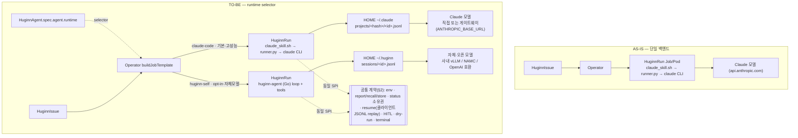

# Huginn Agent Runtime — Pluggable 실행 백엔드 (claude-code ↔ huginn-self)

> **상태**: Draft v0.3 · 2026-06-17 (홈 디렉토리 분리 `~/.claude`↔`~/.huginn` §2.4, claude session = 클라이언트 JSONL replay·stateless API 모델 명문화 §2.5, huginn-self 의 본령은 **자체/비-Claude 모델 실행**이며 claude-code 대비 성능 열위를 전제로 **selector 로 공존**시키는 것이 설계 목적. v0.1 의 BASE_URL 동기·"Go 계약 공유로 drift 제거" 논증은 철회/정정 유지.)
> **범위**: HuginnRun 의 실행 백엔드를 **선택**할 수 있게 한다 — `claude-code`(Claude Agent SDK + claude CLI, 현행·기본·고성능)와 `huginn-self`(Messages/OpenAI-호환 API 를 직접 구동하는 자체 Go 루프로 **자체·오픈 모델 실행**, opt-in). 두 백엔드는 **동일한 런타임 계약(SPI, §2)** 을 만족한다.
> **결론 요약**: huginn-self 의 목표는 **자체/비-Claude 모델(사내 LLM·오픈모델·파인튜닝 모델, OpenAI 호환 등)을 1급으로 실행**하는 것이다. claude-code 가 현재 성능 우위인 것은 자명하므로, 그것을 **기본 백엔드로 유지**한 채 huginn-self 를 **선택 가능한 백엔드**로 두는 selector 가 본 설계의 목적이다(claude ↔ 자체 모델 A/B·점진 개선·워크로드별 선택). 보조 사실(정직성): 단순히 *Claude 모델을* 사내 게이트웨이로 돌리는 것은 자체 백엔드가 필요 없다(claude-code + `ANTHROPIC_BASE_URL`, §3). huginn-self 의 본령은 그 경로로는 불가능한 **비-Claude 모델 실행**이며, 그 대가로 OAuth 불가·context compaction 상실·MCP 상한·운영비 2배(§7)를 감수한다 — 이는 **의도된 trade-off** 다.
>
> **관계**: 본 문서는 `operator-design.md §2.6`("왜 runner.py 를 들어내지 않는가 — 기각된 대안")의 결정을 **존중**한다. §2.6 의 자체-구현 기각은 유효하다 — 본 문서는 그것을 뒤집지 않고, "claude-code 를 기본으로 유지한 채 좁은 opt-in 백엔드를 더한다" 로 한정한다.

---

## 0. 동기와 경계 — 무엇이 selector 를 정당화하는가 (정직한 재정의)

### 0.1 먼저: 게이트웨이/모델 선택은 자체 agent 가 필요 없다 (실측)

`@anthropic-ai/claude-code` CLI 와 `claude-agent-sdk`(이미지에 baked-in)는 아래 env 를 **표준으로 honor** 한다(공식 문서 `code.claude.com/docs/en/llm-gateway`, `.../env-vars`, `.../bedrock-vertex` 실측):

| 목적 | env | claude-code 지원 |
|------|-----|:---:|
| 엔드포인트 교체(사내 게이트웨이/프록시) | `ANTHROPIC_BASE_URL` | ✅ |
| Bearer 인증(게이트웨이 토큰) | `ANTHROPIC_AUTH_TOKEN` | ✅ |
| 게이트웨이 추가 헤더 | `ANTHROPIC_CUSTOM_HEADERS` | ✅ |
| 모델 지정 | `ANTHROPIC_MODEL` 등 | ✅ |
| Bedrock(Claude) 경유 | `CLAUDE_CODE_USE_BEDROCK` + `ANTHROPIC_BEDROCK_BASE_URL` (+`CLAUDE_CODE_SKIP_BEDROCK_AUTH`) | ✅ |
| Vertex(Claude) 경유 | `CLAUDE_CODE_USE_VERTEX` + region/project | ✅ |

`claude-agent-sdk`(Python)는 CLI 를 subprocess 로 띄우며 `os.environ` 을 상속하므로, **operator 가 Job env 에 위 변수를 주입하기만 하면 claude-code 백엔드가 그대로 게이트웨이를 경유**한다. 즉 "사내 게이트웨이/모델 선택" 이라는 최초 요구는 **자체 agent 신설 없이** 달성된다(이것이 §3 의 권장 기본 경로다). **v0.1 이 huginn-self 의 핵심 동기로 든 "BASE_URL 제어" 는 이로써 철회된다.**

### 0.2 huginn-self 의 본령 — 자체/비-Claude 모델 실행 (1급 목표)

**huginn-self 의 목적은 자체/비-Claude 모델(사내 vLLM·NAMC 오픈모델·파인튜닝 모델 등)을 1급으로 실행하는 것**이다. 이들은 대개 OpenAI 호환 API(또는 임의 프로토콜)를 노출하고 **Claude 모델이 아니므로**, claude CLI(Anthropic 프로토콜 + Claude 정체성/프롬프트에 최적화)로는 1급으로 다룰 수 없다.

- claude CLI 는 **Anthropic Messages API 프로토콜 전용**이다. LiteLLM 으로 OpenAI→Anthropic 변환해 claude CLI 에 비-Claude 모델을 물리는 우회가 이론상 있으나, Claude 전용 system prompt/tool 포맷이 강제돼 **비-Claude 모델의 성능·tool-use 특성을 살리지 못하고** OAuth/정체성 제약이 따른다. 자체 루프가 모델의 네이티브 프로토콜(OpenAI function calling 등)을 직접 다루는 편이 맞다.
- 부수효과: 탈-Anthropic 슬림 이미지(Node + claude CLI + Python SDK 제거 → 단일 Go 바이너리 + 운영 CLI).

**성능 열위는 전제다.** 현 시점 자체/오픈 모델은 claude 대비 에이전트 성능이 낮을 것이 자명하다 — 그래서 claude-code 를 **기본**으로 유지하고 huginn-self 를 **선택 가능한 백엔드**로 두는 selector 가 본 설계의 핵심이다(claude ↔ 자체 모델 A/B·점진 개선·워크로드별 선택). 반대로 *Claude 모델을* 사내 게이트웨이로만 돌리는 것은 §3 으로 충분하며 huginn-self 가 필요 없다(혼동 방지).

### 0.3 대가 (huginn-self 채택 시 영구 부채)

- ❌ **OAuth 인증 불가** — `CLAUDE_CODE_OAUTH_TOKEN` 으로 Messages API 를 직접 호출하면 거부된다("OAuth authentication is not supported", `gh anthropics/claude-code#37205`). huginn-self 의 권장 자격은 **`ANTHROPIC_API_KEY`(또는 게이트웨이 Bearer)** 다. claude-code 는 OAuth 도 되므로, 인증 옵션이 **더 좁아진다**.
- ❌ **context compaction 상실** — claude CLI 가 컨텍스트 포화 시 자동 수행하는 대화 압축이 없다. DevOps 워크로드(대용량 로그·`kubectl describe`·`git log`)에서 치명적 → §6 의 **워크로드 적합성 게이트**로 다룬다.
- ❌ **MCP 상한** — `spec.bindings`(ArgoCD/Grafana/Loki…) MCP 자동 연결을 못 쓴다(§6).
- ⚠️ **drift 미해결(부분)** — §4.5 참조: 공유 가능한 건 CRD status 타입(Go↔Go)뿐, **agent↔web report 계약은 cross-language(TS)** 라 codegen 없이는 drift 가 남는다.
- ⚠️ **운영비 2배(TCO)** — 이미지/공급망/conformance/문서 분기(§7).

---

## 1. 모델 — Runtime selector

`AgentSpec.Runtime` 필드는 **이미 존재**하나(`api/v1beta1/huginnagent_types.go` 의 `AgentSpec.Runtime`, 기본값 마커 `+kubebuilder:default=claude-code` 있음, **`+kubebuilder:validation:Enum` 마커는 없음**), operator 어디서도 분기에 쓰이지 않는 **죽은(예약) 필드**다(`helpers.go`/`huginnrun_controller.go` 어디서도 `agent.Spec.Agent.Runtime` 을 읽지 않음). 이를 enum 으로 승격해 살린다. **주의: `api/v1` 패키지도 실재**(`api/v1/huginnagent_types.go`)하므로 enum 마커는 **v1beta1·v1 양쪽**에 추가하고 conversion 영향을 확인한다(operator-design 의 "v1 패키지 아직 없다" 서술은 stale — §10).

```go
// AgentSpec.Runtime — v1beta1 및 v1 양쪽
// +kubebuilder:validation:Enum=claude-code;huginn-self
// +kubebuilder:default=claude-code
Runtime string `json:"runtime,omitempty"`
```

| runtime | 실행 엔진 | 게이트웨이 경유 | 인증 | 이미지 |
|---------|----------|:---:|------|--------|
| `claude-code`(기본) | Claude Agent SDK + claude CLI | ✅ `ANTHROPIC_BASE_URL`/Bedrock/Vertex(§3) | API 키 **또는 OAuth** | Node+Python+CLI(현행) |
| `huginn-self`(opt-in) | Messages API 직접 + 자체 Go 루프 | ✅ Anthropic 호환 직접, OpenAI 호환은 자체 변환 | API 키/Bearer (**OAuth 불가**) | slim Go 바이너리 + 운영 CLI |

**핵심**: 백엔드 선택축은 **모델**이다 — Claude 모델(현재 최고 성능, Anthropic 프로토콜)→`claude-code`(게이트웨이 경유 포함, §3), **비-Claude 자체/오픈 모델**→`huginn-self`. 성능은 claude-code 우위가 자명하므로, selector 로 둘을 공존시켜 워크로드·실험별 선택과 점진 개선을 가능케 하는 것이 목적이다. 게이트웨이 자체는 두 백엔드 모두 경유 가능하다.

### 1.1 설계 변화 (AS-IS → TO-BE)

현행은 claude-code 단일 백엔드다. 변화의 본질은 **HuginnRun 실행 엔진을 `runtime` selector 로 분기**하되, **공통 SPI(§2) 경계는 그대로** 두는 것이다.



---

## 2. SPI — Agent Runtime 계약 (불변 경계)

두 백엔드가 지켜야 하는 계약. `runner.py` 와 operator·muninnWeb 라우트에서 역추출했고, `huginn-self` 의 conformance(§8) 기준이 된다. **report/recall 계약의 실제 server-side 소비자는 operator(Go)가 아니라 muninnWeb(TypeScript) 라우트**(`app/api/runs/[id]/report/route.ts` 등)임에 유의 — §4.5 의 drift 논의가 여기서 출발한다.

### 2.1 입력 — env (operator → 컨테이너)

주입 시점이 둘로 갈린다(operator-design §2.5):
- **Issue 단위**(`buildJobTemplate`): `MUNINN_GOAL`, `MUNINN_GLOBAL_SYSTEM_PROMPT_REF`, `MUNINN_TEAM_SETTINGS_REF`, `MUNINN_GUARDRAILS`(JSON), `MUNINN_APPROVAL_TIMEOUT`, `MUNINN_MEMORY_ENDPOINT`, `MUNINN_API_ENDPOINT`, 인증/도구 Secret(`ANTHROPIC_API_KEY`/`CLAUDE_CODE_OAUTH_TOKEN`/`GITHUB_PAT`/`MUNINN_API_TOKEN`), 선택적 `MUNINN_SOUL_REF`/`MUNINN_EVENT_PAYLOAD_REF`, 재시도 시 `MUNINN_RESUME_SESSION_ID`.
- **Run 단위**(`runScopedEnv`, Run 이름 확정 시): `MUNINN_RUN_NAME`, `MUNINN_ISSUE_NAME`, `MUNINN_AGENT_NAME`, `MUNINN_NAMESPACE`, `MUNINN_WORKSPACE`, `MUNINN_ATTEMPT`, `MUNINN_PR_MODE`(operator env 폴백 `dry-run`).

자격 env 는 **두 범주**로 나뉘며, **둘 다 백엔드 무관**하게 같은 env 로 주입된다(차이는 *사용 방식*뿐 — §2.7):

**(a) LLM 인증** — 모델 호출용:

| env | 출처 | 비고 |
|-----|------|------|
| `ANTHROPIC_API_KEY` / `CLAUDE_CODE_OAUTH_TOKEN` | `agent-secrets`(둘 다 optional, 최소 1) | huginn-self 는 **OAuth 불가** → API 키 필요 |
| `MUNINN_API_TOKEN` | Secret | Muninn API Bearer |

**(b) 도구 자격(tool credential)** — 에이전트가 운영 CLI/도구를 쓰기 위한 자격. **muninnWeb 의 앱 설정 탭에서 입력**(`components/pages.tsx` AgentSettingsTab)되며 K8s Secret 으로 저장될 *예정*:

| env | 출처(설계) | 도구 | 현재 구현 |
|-----|-----------|------|:---:|
| `GITHUB_PAT` | `source.secretRef`(키 `token`) | git / `gh` | ✅ 실주입(`helpers.go`) |
| `KUBECONFIG`(또는 in-cluster SA) | `agent-secrets`(키 `kubeconfig`) 또는 Pod SA | `kubectl` | ⚠️ SA 마운트만, kubeconfig Secret 미배선 |
| `ARGOCD_SERVER` / `ARGOCD_AUTH_TOKEN` | `agent-secrets` | `argocd` | ❌ operator 미주입(런타임은 로깅만) |
| `GRAFANA_TOKEN` / `LOKI_URL` 등 | `spec.bindings` 자격 | grafana/loki/tempo | ❌ 미구현(bindings 데드필드) |

> **구현 현실(정직성, 메인스펙 §5.1 구현현황과 동일 결).** 현재 operator `buildJobTemplate` 은 **`GITHUB_PAT` 만 실제 주입**한다. ArgoCD/Grafana 자격과 **`spec.bindings`(ArgoCD/Grafana/Loki/Harbor) 는 muninnWeb→CRD→Issue 스냅샷까지만 되고 operator 가 읽지 않는 데드필드**다(Job env 로 안 감). muninnWeb 의 자격 입력 폼도 아직 **mock**(값 받고 폐기, Secret 실저장 미배선). 따라서 이 표의 (b) 도구 자격 흐름은 **claude-code 에서도 미완성인 플랫폼 공통 과제**이며, huginn-self 고유 결함이 아니다 — 단 SPI 로 명문화해 **두 백엔드가 같은 주입 계약을 공유**하게 하는 것이 본 절의 목적이다.

`huginn-self` 신규 env(§4.4): `MUNINN_BASE_URL`, `MUNINN_MODEL`, `MUNINN_MAX_OUTPUT_TOKENS`, `MUNINN_AUTH_STYLE`(anthropic|bearer|openai), `MUNINN_TOOL_ALLOWLIST`, (선택)`MUNINN_LLM_PRICE_JSON`.

### 2.2 출력 — HTTP (컨테이너 → API/메모리)

| 호출 | payload / 비고 |
|------|----------------|
| `POST {API}/api/runs/{run}/report` | `{step, cost(decimal str), tokens, output, outcome, sessionId, recalledMemoryIds, issueName(자동 병합), final, failed, terminalKind, requestApproval, approvalReasons}` — **Agent→API 소유 필드만** |
| `POST {API}/api/runs/{run}/recall-report` | `recalledMemoryIds` 전용(merge-patch). 통합 `/report` 에 동봉도 허용(둘 다 가능) |
| `GET {API}/api/runs/{run}` | approval.state 폴링 |
| `POST {MEM}/api/memories/recall` · `/api/memories` | recall/store |
| 인증 | `Authorization: Bearer {MUNINN_API_TOKEN}` |

- **`recalledMemoryIds`** = `[{id, score?, reason?}]`. **`score` 는 문자열로 직렬화**(`str(score)`; web 이 `String()` 강제), `score` 없으면 키 생략.
- **승인 요청은 이중 적재**: `{requestApproval:{reasons:[...]}}` + **top-level `approvalReasons:[...]`** 를 둘 다 실어야 한다(web report route 가 양쪽을 읽어 멱등 처리 — 한쪽만 보내면 트리거 누락 위험).
- **`terminalKind`** 화이트리스트: `rejected`|`expired`|`aborted`(그 외 미전송).

### 2.3 Status 필드 소유권 (operator-design §2.2 — 위반 금지)

- **Agent→API patch**: `step`/`cost`/`tokens`/`output`/`sessionId`.
- **API patch**(에이전트가 *보고*하면 API 가 status 에 반영): `recalledMemoryIds`(recall-report 경로), `approval`/`AwaitingApproval` 전이.
- **Operator patch**: `phase`/`startedAt`/`finishedAt`/`duration`/`jobName`/caps/`conditions`.
- `huginn-self` 는 Agent→API 소유 필드만 직접 쓰고, `recalledMemoryIds` 는 **보고**(API 가 patch)한다. `phase`/`approval` 은 절대 직접 쓰지 않는다.

### 2.4 영속 — 백엔드별 홈 분리 + resume (메인스펙 §5.5 · operator-design §2.6)

**홈 디렉토리를 백엔드별로 분리한다**(claude CLI 가 없는 huginn-self 가 `.claude` 를 빌리는 어색함·포맷 혼재 제거):

| 백엔드 | 마운트 경로(HOME 하위) | operator 상수 | transcript |
|--------|------------------------|---------------|------------|
| claude-code | `/home/node/.claude` | `claudeMountPath`(현행) | `projects/<cwd-hash>/<id>.jsonl`(claude CLI 소유) |
| huginn-self | `/home/node/.huginn` | `huginnMountPath`(신규) | `sessions/<id>.jsonl`(자체 소유) |

```
pvc-agent-<app>  (앱별 1개, RWO, subPath=Issue 로 물리 격리)
   ├ <issue-A>/  ──(mountPath, runtime별 분기)──▶  claude-code: ~/.claude → projects/<hash>/<id>.jsonl
   │                                              huginn-self: ~/.huginn → sessions/<id>.jsonl
   └ <issue-B>/  ──▶ …
        ▲ initContainer 가 PVC 루트(/claude-store)에 <issue>/ 를 mkdir(소유권 uid 1000)
          → 이 디렉토리는 mountPath(.claude/.huginn)와 무관(PVC 안 같은 경로). main 은 mountPath 만 분기.
   한 Issue = 한 백엔드(effectiveRuntime 동결) → subPath 안엔 항상 한 종류 → 비호환 transcript 안 섞임
```

- **PVC 는 앱별 1개로 공유**, `subPath=Issue.Name`(operator 부여). **한 Issue=한 백엔드**(§5 effectiveRuntime 동결 채택 시)이므로 subPath 안엔 항상 한 종류만 들어간다 → PVC 공유 안전, **마운트 경로(mountPath)만 runtime 별 분기**.
- **initContainer 는 mountPath 와 무관하게 그대로 재사용된다**(코드 확인): 현재 `claude-home-init` 은 PVC 루트를 `claudeStoreInitPath`(`/claude-store`)로 마운트하고 그 안의 `subPath`(=Issue) 디렉토리를 `mkdir -p` 해 소유권을 uid/fsGroup 1000 으로 잡는다(`huginnrun_controller.go`). **이 디렉토리는 main 이 `.claude` 로 붙이든 `.huginn` 으로 붙이든 PVC 안에서 동일한 `<issue>/`** 다 — init 은 "PVC 안 subPath 디렉토리 선생성"만 하므로 mountPath 를 알 필요가 없다. 따라서 huginn-self 에서도 fsGroup·쓰기권한 문제 없이 동작한다. main 컨테이너의 `VolumeMount.MountPath` 만 runtime 별로 `claudeMountPath`↔`huginnMountPath` 로 분기하면 된다.
- **네이밍 개편(권장, §10-6)**: `claudeStoreInitPath`/`CLAUDE_HOME_DIR`/`claude-home-init` 은 백엔드 무관인데 claude-편향이다 → `agentStoreInitPath`/`AGENT_HOME_DIR`/`agent-home-init` 로 **리네임**(기능 무변경, 하위호환 불요 — CLAUDE.md 규약).
- **resume 경계 = Issue**(같은 Issue 의 attempt 들만 같은 transcript 공유, Issue 간 격리)는 두 백엔드 공통.
- **transcript 비호환** → **cross-backend resume 금지**(§5 effectiveRuntime 동결 ①+③ 채택 시 강제). 경로가 `.claude` vs `.huginn` 으로 물리 분리되어 오파싱도 원천 차단.
- **`sessionId`**: claude-code 는 SDK 스트림에서 추출, huginn-self 는 server-side 세션이 없으므로 **자체 생성**(`sess-`+uuid4) 후 첫 turn 전 즉시 보고(도중 사망에도 resume 보존).
- **resume preflight(백엔드 무관 의무)**: `MUNINN_RESUME_SESSION_ID` 존재 + **해당 백엔드 transcript 파일 실재 확인** 시에만 resume, 없으면 **새 세션 폴백**(깨진 resume 으로 retry budget=`maxRuns` 1회를 태우지 않기 위함 — `runner.py:_has_transcript` 의미를 SPI 레벨로 승격).

### 2.5 session 모델 — 클라이언트 JSONL replay (claude-code 동작 = huginn-self 재현 근거)

claude code 의 session 은 **100% 클라이언트 측 파일 기반이고 Anthropic API 는 stateless** 다(공식 문서 `code.claude.com/docs/en/sessions`, `.../how-claude-code-works` 실측). 이 사실이 huginn-self 가 resume 을 **동등 재현 가능**한 근거다:

```
[turn 마다]  메시지 1줄씩 append ─▶ <id>.jsonl
[API 호출]   jsonl 전체 history ─▶ messages[] 로 매번 재전송   (서버=stateless, 세션 기억 안 함)
[resume]     jsonl 읽어 messages[] 복원 ─▶ 이어서 append       (서버 측 상태 의존 0)

  claude-code  ~/.claude/projects/<cwd-hash>/<id>.jsonl   (cwd=/workspace 고정 → hash 안정)
  huginn-self  ~/.huginn/sessions/<id>.jsonl              (직접 경로 → cwd-hash 불필요)
        └ 둘 다 같은 "로컬 replay" 모델 → huginn-self 가 resume 동등 재현 가능
        ⚠ 진짜 난제는 resume 이 아니라 history 누적 시 compaction (§6-1)
```

- **저장**: 매 turn 메시지 객체(user/assistant/tool_use/tool_result)를 `<id>.jsonl` 에 **append**.
- **API 호출**: 서버는 세션을 기억하지 않음 → 매 호출마다 **jsonl 전체 history 를 messages[] 로 다시 전송**(연속성 = 클라이언트가 history 첨부).
- **resume = replay**: jsonl 전체를 읽어 messages[] 복원 → 새 메시지 append → 같은 파일에 이어 씀. **서버 측 상태 의존 0**.
- **claude-code 의 cwd 의존성**: claude 는 `projects/<cwd-hash>/` 로 묶으므로 cwd 가 다르면 resume 실패 → muninn 은 Dockerfile `WORKDIR /workspace` 로 cwd 를 고정해 회피하고, runner 의 preflight(`_has_transcript`)는 `projects/*/<id>.jsonl` **glob**(`*`=cwd-hash 와일드카드)으로 찾아 cwd-hash 변화에도 강건하다. huginn-self 는 `sessions/<id>.jsonl` 직접 경로라 **cwd-hash 개념 자체가 불필요**.
- **preflight 경로는 백엔드별로 다르다**(SPI §2.4): claude-code = `~/.claude/projects/*/<id>.jsonl` glob, huginn-self = `~/.huginn/sessions/<id>.jsonl` 직접 — 같은 "없으면 새 세션 폴백" 시맨틱을 **각 백엔드가 자기 경로로** 구현한다(공통 함수 아님).
- **한계(§6 과 연결)**: replay(history 저장·복원)는 쉽지만, claude CLI 가 추가로 해주는 **auto-compaction(컨텍스트 포화 시 자동 요약)** 은 별개 과제다. huginn-self 는 history 가 길어지면 그대로 prepend 하므로 context window 초과 위험 → **직접 compaction 전략 필요**(진짜 어려운 건 resume 이 아니라 이것).

### 2.6 행위 (컨테이너 내부)

- **terminal 보고 정확히 1회**(`final:true`) — 정상/예외/SIGTERM/취소 전 경로. 미보고 시 incident 'running' 영구 고착.
- **SIGTERM grace 예산** 내 terminal 보고 + **HITL 거절 선점 감지**(suspend→SIGTERM 이 폴링 선점 시 terminal 보고 전 `approval.state` 확인 → `terminalKind=rejected`).
- **HITL 승인 게이트**: `requireApproval` 시 위험 작업 전 승인 요청(§2.2 이중 적재) → `AwaitingApproval` → 폴링으로 **`Approved`/`Rejected`/`Expired` 세 종결을 모두 처리**. ※ `Expired` 는 web 이 `approval.expiresAt` 경과 기준으로 **lazy 표면화**하므로 실제 도달 가능(runner.py 의 "Expired 도달 불가" 주석은 stale — §10). 매핑: rejected→`rejected`, expired→`expired`, timeout→`aborted`.
- **dry-run PR mode**: `MUNINN_PR_MODE=dry-run` 이면 실제 `gh pr create` 금지, **PR 계획을 output 으로**(형식: ① 제목 한 줄, ② 변경 요약, ③ `` ```diff `` fenced). outcome 접두 `DRY-RUN PR:`.
- **selftest**: API 호출 없이 배선 검증 후 exit(오프라인 CI/kind QA).
- **guardrail 집행**: §4.3 한계(turn 경계 overshoot, maxTokens 사후추적) 참조.
- **도구 자격 구성(§2.7)**: 부팅 시 §2.1(b) 자격 env → 운영 CLI 자격으로 구성.

### 2.7 도구 자격 구성 — `configure_auth` 동등 계약 (백엔드 무관)

§2.1(b)의 도구 자격은 **env 로 주입(operator 책임, 백엔드 무관)** 되고, 각 백엔드는 부팅 시 이를 **운영 CLI 가 쓸 수 있는 형태로 구성**해야 한다. claude-code 는 `claude_skill.sh configure_auth()` 가 담당 — huginn-self 는 **Go 바이너리 부팅(init) 단계에 동등물**을 둔다. 이 구성 단계가 SPI 행위 계약이다:

```
muninnWeb 앱설정       K8s Secret              operator(백엔드 무관 주입)        백엔드 "사용"
──────────────────────────────────────────────────────────────────────────────────────────
GITHUB_PAT       ┐                                                       claude-code   huginn-self
ARGOCD_*         ├─입력─▶ agent-secrets ──▶ buildJobTemplate ──env──▶  configure_auth   부팅 init
GRAFANA_TOKEN    │      / source.secretRef      │ (자격 env)            (claude_skill)  (Go 동등물)
KUBECONFIG/SA    ┘                              │                       · git/gh         · git/gh
spec.bindings ───┐                             │                       · argocd         · argocd
 (ToolBinding     └ inheritedBindings ─────────┘                       · kubectl(SA)    · kubectl(SA)
  .secretRef)       operator 가 secretRef → 도구별 표준 env 주입            │                │
                                                                       MCP 또는 CLI     §4.4 tool/HTTP
  ★ 자격 "주입"(operator→env)·"구성"(부팅)은 백엔드 무관 = 공통 SPI. 다른 건 "사용 방식"(MCP vs CLI/HTTP)뿐.
```

| 자격 | 구성 동작(두 백엔드 공통 의무) |
|------|--------------------------------|
| `GITHUB_PAT` | `git credential.helper store` + `~/.git-credentials`(umask 077, 0600) + `GH_TOKEN` export |
| `KUBECONFIG`/SA | **kubectl 인증 출처 명시**: 기본은 Pod 의 `huginn-agent` ServiceAccount(in-cluster, 자기 namespace RBAC — `expandPodSpec` 공유). 멀티클러스터면 `agent-secrets[kubeconfig]` → `KUBECONFIG` 마운트. **두 백엔드 동일**(huginn-self 도 같은 SA 상속). |
| `ARGOCD_SERVER`/`ARGOCD_AUTH_TOKEN` | argocd CLI 자격 구성(env 또는 `argocd login`) |

- **tool *사용* 방식만 백엔드별로 다르다**: claude-code 는 (장차) MCP 서버 또는 CLI, huginn-self 는 §4.4 의 tool(`gh`/`kubectl_ro`/`bash`) 또는 HTTP. **자격 주입(operator→env)과 구성(부팅)은 공통**이라 SPI 로 공유한다.
- **`spec.bindings` 자격 흐름(스키마 확정)**: `ToolBinding` 은 현재 `instance`+`config` 만 갖고 자격 필드가 없는 **모순**(데드필드)이다 → **`ToolBinding.secretRef`(`+optional`, Secret 이름 + 키맵) 를 추가**하는 안으로 단일화한다. 자격을 CRD(`ToolBinding.secretRef`)에 두면 webhook 순수 검증이 가능하다 — `platform_tool` 레지스트리 안은 게이트웨이 `tool_id` 매핑(이미 `instance` 가 담당)과 책임이 겹쳐 폐기. operator 가 `inheritedBindings` 순회 → 각 `binding.secretRef` → **도구별 표준 env** 로 주입(매핑 고정):

  | binding | 주입 env |
  |---------|----------|
  | `deployment.argocd` | `ARGOCD_SERVER` / `ARGOCD_AUTH_TOKEN` |
  | `observability.grafana` | `GRAFANA_URL` / `GRAFANA_TOKEN` |
  | `observability.loki` | `LOKI_URL`(+필요 시 토큰) |
  | `registry.harbor` | `HARBOR_URL` / `HARBOR_TOKEN` |

  이 주입은 **백엔드 무관**이며 MCP 가용 여부와 독립 — huginn-self 가 MCP 를 못 써도 `GRAFANA_TOKEN` env + `bash`(curl) tool 로 관측 백엔드를 쓸 수 있다(claude-code 의 MCP 경로는 그 위의 선택지).
- **시크릿 스크럽 확장(§6-3)**: huginn-self `bash` tool subprocess env 스크럽 목록에 **도구 자격 중 그 tool 에 불필요한 것**을 포함(예: grafana 조회용 bash 에 `ARGOCD_AUTH_TOKEN` 노출 최소화). 단 해당 tool 이 실제 쓰는 자격(예: `gh` → `GH_TOKEN`)은 남긴다.

---

## 3. claude-code 게이트웨이 경유 (권장 기본 경로)

§0.1 의 실측에 따른 **1순위 경로** — 자체 agent 없이 사내 게이트웨이/모델 선택을 달성한다.

- **operator 주입**: runtime=`claude-code` 일 때 `buildJobTemplate` 이 (설정 시) `ANTHROPIC_BASE_URL`/`ANTHROPIC_AUTH_TOKEN`/`ANTHROPIC_CUSTOM_HEADERS`/모델 env, 또는 Bedrock/Vertex 경로 env 를 Job 에 추가. SDK 가 subprocess CLI 로 그대로 상속.
- **AgentSpec 확장**: `agent.baseUrl` / `agent.model` / `agent.authStyle`(+ Bedrock/Vertex 토글) 선택 필드. webhook 순수 검증으로 형식 점검(operator-design §4 의 "webhook 은 순수 함수" 원칙 — DB 조회 없음).
- **게이트웨이 요건**: Anthropic `/v1/messages`(+ `count_tokens`) 스키마, `anthropic-beta`/`anthropic-version` 헤더 전달. OpenAI 전용이면 LiteLLM 등 변환 프록시를 앞단에 두면 claude-code 가 그대로 동작한다.

> 이 경로는 context compaction·MCP·OAuth·resume 을 **모두 보존**하므로, "게이트웨이만 필요" 한 워크로드는 huginn-self 가 아니라 **이 경로를 쓴다**.

---

## 4. huginn-self 백엔드 (Go) — 좁은 opt-in

### 4.1 operator 분기

runtime 분기는 `buildJobTemplate` 에서 image/command/env 를 가른다. **주의: command 는 현재 상수 `agentSkillCmd`(`/usr/local/bin/claude_skill.sh`)로 2곳에 하드코딩**(`helpers.go`, `huginnrun_controller.go`)돼 있어, "한 곳 분기"가 아니라 **두 곳 모두 runtime 분기로 교체**해야 한다. `expandPodSpec` 고정 필드 중 non-root uid 1000·restartPolicy=Never·컨테이너 이름은 공유하되, **HOME 마운트 경로는 runtime 별로 분기**(`claudeMountPath`↔`huginnMountPath`, §2.4) — subPath(=Issue.Name)·initContainer 패턴은 mountPath 만 치환해 공유.

```
claude-code → image=claudeCodeImage, command=[claude_skill.sh], mountPath=/home/node/.claude (+ §3 게이트웨이 env)
huginn-self → image=huginnSelfImage, command=[huginn-agent],    mountPath=/home/node/.huginn
              + {MUNINN_BASE_URL, MUNINN_MODEL, MUNINN_MAX_OUTPUT_TOKENS, MUNINN_AUTH_STYLE, MUNINN_TOOL_ALLOWLIST}
```

### 4.2 이미지 결정

operator config flag 신설(`--claude-code-image`/`--huginn-self-image`)로 runtime 별 기본 이미지를 결정하고, **현재 required 인 `agent.image` 는 제거**(선택적 오버라이드로만 잔존, §10-5) — 운영자가 runtime 과 안 맞는 이미지를 주는 모순을 구조적으로 제거. 하위호환 안 함(프로토타입). webhook 으로 오버라이드 image↔runtime 정합 검증. **변경 표면**: config flag 2종 + webhook 규칙 + CRD(v1beta1·v1) 재생성 + `TestBuildJobTemplate`/controller 테스트 갱신.

### 4.3 Agent loop (SDK `query()` 대체)

```
messages = [user: goal (+recall)]                  // resume 면 자체 transcript prepend
ctx,cancel = WithCancel; SIGTERM→cancel
for turns < maxTurns {
    resp = client.Messages(ctx, {model, system, messages, tools, max_tokens})
    messages += assistant(resp.Content); usage 누적 → cost; report({step,cost,tokens})
    if resp.StopReason=="end_turn" { break }
    results = execTools(ctx, resp.toolUse)          // 복수 tool_use: 각 tool_result 를 tool_use_id 로 매칭,
    messages += user(results)                        //   하나의 user 메시지로 집계(누락 시 API 400)
    appendTranscriptJSONL()
    if turns>=maxTurns { isErr; subtype="max_turns"; break }
    if cost>=maxBudget { isErr; subtype="max_cost"; break }   // ← turn 경계 집행: 최대 1 turn overshoot
}
sendFinal(...)   // defer/recover + signal → terminal 1회 보장(§2.6)
```

- **guardrail 정직성**: `maxCostUsd` 는 turn 완료 후 점검이라 **최대 1 turn overshoot**(MUNINN_MAX_OUTPUT_TOKENS 로 turn 비용 상한). `maxTokens` 는 Messages API 에 hard-stop 옵션이 없어 **사후 추적**(집행 아님). claude-code 의 SDK 거동과 차이를 문서화.
- **tool 동시성**: read-only(read/kubectl_ro) 병렬 허용, mutating(bash/gh) 순차 + dry-run 거부.

### 4.4 Tool 카탈로그 / API client / Session / Cost

- **tool**: `bash`(argv allowlist + **`bash -c` 래핑 탐지** + dry-run mutating 거부), `read_file`/`write_file`/`edit_file`(`EvalSymlinks` 로 `/workspace` 경계, symlink 탈출 차단), `gh`(인자 분리, `GH_TOKEN`), `kubectl_ro`(get/describe/logs/top 화이트리스트). 관측·배포 도구(argocd/grafana/loki)는 **전용 tool 또는 `bash`(argocd CLI/curl)** 로 §2.7 자격 env(`ARGOCD_*`/`GRAFANA_TOKEN`)를 써 호출 — MCP 불필요.
- **도구 자격(§2.7 구현)**: 부팅 init 에서 `configure_auth` 동등 단계 수행 — `GITHUB_PAT`→git/`GH_TOKEN`, `ARGOCD_*`→argocd CLI. **`kubectl_ro` 인증 출처 = Pod `huginn-agent` SA(in-cluster, 자기 namespace RBAC)** — claude-code 와 동일 SA 상속(`expandPodSpec` 공유), 멀티클러스터면 `KUBECONFIG` Secret 마운트.
- **API client**: `MUNINN_AUTH_STYLE` 분기 — `anthropic`(x-api-key, **권장 기본**), `bearer`(게이트웨이 토큰), `openai`(호환 게이트웨이 스키마 변환). **OAuth(`CLAUDE_CODE_OAUTH_TOKEN`)는 Messages API 직접 호출 불가 → 사용 금지, API 키 필요**(§0.3).
- **session**: `/home/node/.huginn/sessions/<id>.jsonl`(content-block JSONL, §2.5 replay 모델), §2.4 preflight 의무.
- **cost 권위 출처**: 게이트웨이가 응답으로 실제 과금을 주면 그것을 신뢰, 못 주면 `usage`×단가표(`MUNINN_LLM_PRICE_JSON` 주입)로 **보수적 상한**. 게이트웨이 경유 시 단가 괴리로 `maxCostUsd` 가 부정확해질 수 있음을 status/로그에 표기. cost 추정 불가 시 정책(fail-closed=중단 / fail-open=계속)을 명시 결정.
- **selftest**: Go 바이너리 + 운영 CLI 존재 + tool 스키마 + `/home/node/.huginn` 쓰기 + 보고 배선(닫힌 포트). `claude` CLI 점검 제거.

### 4.5 계약 공유와 drift (정직한 한계)

v0.1 의 "Go 타입 공유로 drift 불가" 는 **부분만 참**이다:
- ✅ **공유 가능**: CRD status 타입(`HuginnRunStatus`, Go↔Go) — operator 모듈 타입을 import.
- ❌ **공유 불가**: **agent→web report/recall 요청 계약**. 실제 소비자는 muninnWeb(**TS**) 라우트이고, operator 에 report *요청* 구조체는 없다(codegen 부재). Go 백엔드도 Python `runner.py` 와 똑같이 **TS 계약을 손으로 맞춰야** 한다 — 컴파일러는 TS 를 강제하지 못한다.
- **모듈 토폴로지 결정 필요**: `huginnAgentRuntime` 엔 **go.mod 가 없다**(현재 Python). huginn-self 는 새 Go 빌드/배포 단위다. 공유 status 타입을 쓰려면 (a) `pkg/runtimeapi` 를 operator 모듈 **밖** 독립 모듈로 분리해 operator·huginn-self 가 **둘 다 소비자**가 되게 하거나, (b) 같은 모듈에 두어 operator 바이너리에 에이전트 코드가 섞이고 CRD 마커 변경이 에이전트 재빌드를 강제하는 결합을 감수. "drift 불가" 는 **단일 빌드 그래프 전제**일 때만 성립.
- **drift 를 정말 닫으려면**: report 계약을 단일 스키마로 **codegen(openapi/proto→Go+TS)** 하거나, §8 conformance 가 **web 라우트 검증까지 실제로 태운다**.

---

## 5. Immutability & cross-backend resume (정정)

v0.1 의 "runtime 은 Issue 단위 스냅샷이라 진행 중 백엔드 불변" 은 **틀렸다**. `buildJobTemplate` 은 Issue 가 아니라 **attempt(Run)마다** 호출된다(Issue controller 재시도 경로가 라이브 `agent` 를 다시 읽어 `createRun→buildJobTemplate` 수행). JobTemplate 의 CEL immutable(`huginnrun_types.go` 의 `jobTemplate` XValidation)은 **이미 만들어진 Run 의 JobTemplate 만** 고정한다 — 다음 attempt 의 새 Run 은 그 시점 `agent.Spec.Agent.Runtime` 을 **새로 스냅샷**한다.

→ 운영자가 같은 Issue 진행 중 runtime 을 바꾸면 attempt N+1 이 **새 백엔드**로 뜨면서 attempt N(구 백엔드)의 `status.sessionId` 를 `MUNINN_RESUME_SESSION_ID` 로 상속(withResumeSession)한다. §2.4 의 비호환 transcript 때문에 **cross-backend resume 손상**.

**해소(①+③ 채택 확정)**:
1. ✅ **effectiveRuntime 동결**: 첫 attempt(첫 `createRun`) 시점 runtime 을 **`HuginnIssue.status.effectiveRuntime`** 에 기록하고, 이후 attempt 는 그 값을 사용(Agent.runtime 변경은 *다음 Issue* 부터). 소유권: **Operator(생성 시 1회 기록, 이후 read-only)** — operator-design §2.2 표에 `maxStep`/`maxCostUsd` 와 동일 패턴으로 추가. "첫 Run 의 JobTemplate 에서 역산" 대안은 Run GC 시 유실되므로 폐기.
3. ✅ **resume 백엔드 일치 가드**: `withResumeSession` 이 직전 attempt 와 **백엔드가 같을 때만** sessionId 주입, 다르면 새 세션(이중 안전).
2. ❌ **webhook 가드(기각)**: "진행 중 Issue 있으면 `Agent.runtime` 변경 거부" 는 cluster 의 HuginnIssue 목록 조회가 필요해 **webhook 순수성 원칙(operator-design §4: 외부 의존 없는 순수 함수) 위반** → 기각. 굳이 능동 거부를 원하면 webhook 이 아니라 **Issue/Agent reconciler** 가 처리(①이 이미 안전을 보장하므로 불요).

---

## 6. 선결 위험 (워크로드 적합성 게이트)

1. **🔴 context compaction 부재 = huginn-self GA 전제(자기 목표와 직접 충돌)** — claude CLI 의 auto-compaction 이 없으면 history 를 그대로 prepend(§2.5)하므로 윈도우 초과로 실패한다. **이건 부수 한계가 아니라 huginn-self 1급 목표(자체/오픈 모델 실행)와 정면충돌**한다: 자체/오픈 모델(예제 CR 의 `qwen2.5-coder-32b` 등)은 통상 Claude(200K)보다 **작은 윈도우(32K~128K)** 라, 같은 DevOps 워크로드(대용량 `kubectl describe`·로그)에서 claude-code 보다 **더 빨리** 깨진다 — "게이트웨이 필요한 앱일수록 진단 부하 큼" 모순이 자체모델에선 윈도우까지 작아 더 심하다. 따라서 compaction 전략(요약 LLM 호출 / sliding window + pin / tool 출력 캡)은 **선택이 아니라 huginn-self GA 전제 조건**이며, 미구현 시 초기 출시 워크로드를 **단문·단기 멀티턴**으로 명문 제한한다.
2. **🔴 bash 인젝션** — argv[0] allowlist 는 `bash -c`/`eval`/변수조합을 못 막음. `MUNINN_GOAL`(untrusted webhook 파생) → `bash -c` 래핑 탐지 + tool 출력 2차 주입 정제.
3. **🟠 시크릿 스크럽** — subprocess env 에서 `ANTHROPIC_API_KEY`/`CLAUDE_CODE_OAUTH_TOKEN`/`GITHUB_PAT`/**`MUNINN_API_TOKEN`** 제거(GH_TOKEN 만).
4. **🟠 SSRF/모델 화이트리스트** — `MUNINN_BASE_URL` 도메인 + `MUNINN_MODEL` 화이트리스트 검증.
5. **🟠 cost 부정확** — 게이트웨이 단가 괴리(§4.4) → guardrail fail-closed/open 정책 결정.
6. **🟡 prompt caching** — `cache_control:{type:ephemeral}` 수동 부착 안 하면 비용 증가.
7. **🟡 MCP 기능 상한(자격은 별개)** — huginn-self 는 MCP 자동 연결을 못 쓴다. **단 `spec.bindings` 자격 자체는 §2.7 대로 env+CLI/HTTP 로 흐르므로 도구 사용은 가능**(MCP 는 그 위의 편의). 진짜 상한은 *MCP 전용 도구의 동적 발견·표준 협상* 으로, 그게 로드맵 핵심이 되면 Go MCP 클라이언트 재구현 필요 → 마이그레이션 리스크.
8. **🟡 OAuth 불가** — §0.3.

> 위 부채는 huginn-self 백엔드 책임이며 claude-code 는 영향 없다 — selector 가 **리스크는 격리**하나 **유지보수 비용은 격리하지 못한다**(§7).

---

## 7. TCO — selector 총소유비용

selector 는 복잡도를 *제거*하지 않고 *영구 분기*로 고정한다. 정직한 증분:

| 항목 | claude-code 단독 | + huginn-self |
|------|:---:|:---:|
| 이미지 빌드/멀티아치 push/공급망(SBOM·checksum·base) | 1 | **2** |
| e2e conformance 매트릭스(runtime 2종: claude-code·huginn-self) | 1 | **2**(시간·flake) |
| §6 결함(8개) 유지보수 | 0 | **영구** |
| 문서/SOUL/스킬/runbook 분기 | 1 | **2** |

**정당화 조건**: **자체/비-Claude 모델 실행이 전략 목표**일 때(모델 주권·비용·온프렘·실험·claude 대비 A/B). claude 모델만 쓰면서 게이트웨이만 필요하면 §3(claude-code + `ANTHROPIC_BASE_URL`)으로 충분하다. 성능 열위를 전제로 한 **의도된 공존**이므로 TCO 2배는 그 전략적 가치와 견준다.
**수명 결정**: selector 가 영구 옵션인지, huginn-self 채택 후 claude-code sunset 으로 가는 **마이그레이션 브리지**인지 명시(권장: 수요 검증 전까지 **opt-in 실험**, 영구 약속 보류).

---

## 8. Conformance 테스트 — selector 의 생명선

runtime 파라미터화한 **단일 스위트**로 두 백엔드를 동일 검증(drift 차단):
- report payload 형식(issueName 병합·recalledMemoryIds score **문자열 직렬화** 라운드트립·approval 이중 적재), terminal 보고 정확히 1회, **resume 라운드트립(같은 백엔드)**, HITL **거절 선점 + expiry(expiresAt 경과→expired)**, dry-run 산출물 형식(제목/요약/```diff```), selftest exit 0, **다중 tool_use 라운드트립(tool_use_id 매칭)**, maxCost overshoot 경계.
- **web 라우트까지** 태워 cross-language(TS) 계약을 검증(§4.5).
- kind e2e 매트릭스 `runtime∈{claude-code, huginn-self}`.

---

## 9. 마이그레이션

1. `Runtime` enum 화(**v1beta1·v1 양쪽**) + webhook 정합 + `buildJobTemplate`·command 하드코딩 2곳 분기. **개편 묶음(§10-5,6,7, 하위호환 불요)**: `agent.image` required 제거+operator 기본 이미지, claude-편향 네이밍/PVC 리네임. claude-code *실행 동작*은 불변(이미지/경로만 정리). `make manifests generate` + 테스트 갱신.
2. **§3 먼저**: claude-code 게이트웨이 env 주입(`agent.baseUrl/model/authStyle`) — 사용자의 실제 목표(게이트웨이/모델)를 **자체 agent 없이** 먼저 충족.
3. SPI(§2) 를 operator-design 에 § 섹션으로 명문화 + conformance(§8) — claude-code 기준선 확보(web 라우트 포함).
4. (수요 확인 시) huginn-self Go PoC: 공유 모듈 토폴로지(§4.5) 결정 → text-only → read-only tool → mutating 점진.
5. huginn-self 이미지(checksum 검증 패턴 계승, 사내 base=`mona-public` p_success) + selftest.
6. `runtime: huginn-self` **opt-in 출시**, conformance+e2e 매트릭스 게이트, effectiveRuntime 동결(§5).

---

## 10. 정정·개편 제안 (하위호환 비필수 — CLAUDE.md 규약)

> **구현 상태: 제안(미구현).** 본 문서는 설계 제안이다. §2.7 selector 핵심(Runtime enum 마커·`buildJobTemplate`/command 분기·effectiveRuntime 동결·HOME 분리·도구자격 주입)은 **현재 코드에 없다** — 아래는 *향후 구현 대상*이다. 현 코드 사실: `AgentSpec.Runtime` 은 enum 마커 없는 죽은 필드(`+kubebuilder:default=claude-code` 만), `agentSkillCmd` 는 `helpers.go`/`huginnrun_controller.go` 2곳 하드코딩, `buildJobTemplate` 은 `GITHUB_PAT` 만 주입, `spec.bindings` 는 operator 가 안 읽음.

프로토타입이므로 데드필드·모순·편향 네이밍은 **점진 호환보다 재설계/제거를 우선**한다(운영 데이터 유실 위험 없음).

1. **`operator-design.md §2.6`**: (a) "raw Messages API 자체 루프" 기각의 **BASE_URL 우려 무효**(claude-code 가 `ANTHROPIC_BASE_URL` 지원). (b) selector 행 추가. (c) **§0 의 "CRD v1 패키지·conversion 은 아직 없다" 는 stale** — `api/v1` 패키지 실재(served 안 함, conversion webhook 없음) → "v1beta1·v1 양쪽 존재" 로 정정.
2. **`runner.py`**: `gate_approval` "Expired 도달 불가" 주석 **stale** — 정정.
3. **`Runtime` enum 화**(`api/v1beta1`·`api/v1`): `+kubebuilder:validation:Enum=claude-code;huginn-self` + operator 분기 배선(현재 죽은 필드 → 살리기보다 selector 의 1급 축으로 재설계).
4. **메인 §5**: "Claude Agent SDK 로 루프" → "runtime 백엔드가 루프" 일반화, §5.3/§5.4 "SDK 계약" → 백엔드 SPI 추상화.
5. **`agent.image` 개편(호환 안 함)**: required `image` 를 **제거**하고 operator 가 runtime 별 기본 이미지 결정(`--claude-code-image`/`--huginn-self-image`), `agent.image` 는 선택적 오버라이드로만 잔존. **연쇄 변경(누락 방지)**: (a) `JobTemplate.Image` 에 `+kubebuilder:validation:MinLength=1` 이 걸려 있어 — `buildJobTemplate` 이 `agent.image` 비면 **operator 기본 이미지로 `JobTemplate.Image` 를 먼저 채워야** CRD 검증 통과(`helpers.go` 의 `agent.Spec.Agent.Image` 직대입 변경). (b) **muninnWeb**: 앱등록 폼(`pages.tsx` "런타임 이미지" 필수입력)을 선택 오버라이드로 격하 + runtime Select 에 `huginn-self` 추가 + `apps` PUT 검증("agent.image must be non-empty") 완화 + `AppVM.image`(`incidents.ts`) optional 화.
6. **홈 디렉토리 분리(§2.4)**: `huginnMountPath="/home/node/.huginn"` 상수 추가, `expandPodSpec` 의 mountPath runtime 별 분기. **claude-편향 네이밍 개편**: 내부 상수 `claudeStoreInitPath`/`CLAUDE_HOME_DIR`/`claude-home-init` → `agentStoreInitPath`/`AGENT_HOME_DIR`/`agent-home-init`. **CRD 공개 필드도 함께 리네임**(지금이 깰 수 있는 유일 시점): `JobTemplate.ClaudePVCName`/`ClaudeSubPath`(`json: claudePVCName/claudeSubPath`) → `AgentPVCName`/`AgentSubPath`(`agentPVCName/agentSubPath`) — 백엔드 무관 필드라 selector 후 "claudeSubPath 에 huginn-self transcript" 어색함 제거. 기능 무변경, 호환 불요.
7. **PVC 명 리네임(`pvc-claude-<app>`→`pvc-agent-<app>`)**: claude-편향 → 중립명. **orphan 처리(누락 방지)**: `ensurePVC` 는 이름 Get→없으면 Create 라, 리네임 후 reconcile 하면 새 `pvc-agent-*` 가 Create 되고 기존 `pvc-claude-*` 는 Agent ownerRef 를 단 채 남아 **GC 안 됨(앱마다 PVC 2개=스토리지 누수)**. 따라서 (a) 일회성 cleanup(reconcile 에서 legacy 이름 PVC 발견 시 delete) 또는 (b) kind 클러스터 재생성 전제 중 하나를 **함께 명시**. 데이터 유실이 아니라 orphan 누적 문제임에 유의.
8. **도구 자격·bindings 주입 신설(§2.1(b)·§2.7)**: 현재 `GITHUB_PAT` 만 주입, `ARGOCD_*`/`GRAFANA_TOKEN`·`spec.bindings`(inheritedBindings)는 **데드필드**. **재설계 확정**: `ToolBinding` 에 자격 필드가 없는 모순을 **`ToolBinding.secretRef` 추가**(§2.7)로 해소 — operator 가 `inheritedBindings` 순회 → `secretRef` → 도구별 표준 env 주입. muninnWeb mock 자격 폼도 K8s Secret 실저장으로 배선. claude-code·huginn-self 공통 과제(선행/병행).
9. **`effectiveRuntime` status 소유권(§5)**: `HuginnIssueStatus.effectiveRuntime` 신설 — **Operator 소유(첫 createRun 시 1회 기록, 이후 read-only)**, `maxStep`/`maxCostUsd` 와 동일 패턴으로 operator-design §2.2 소유권 표에 추가.

---

## 부록: 예제 CR

```yaml
apiVersion: muninn.io/v1beta1
kind: HuginnAgent
metadata: { name: payments-api, namespace: ns-team-pay }
spec:
  workspaceId: ns-team-pay
  kind: fastapi
  output: pull_request
  source: { repo: acme/payments-api }
  identity: { k8sNamespace: ns-team-pay }
  guardrails: { maxIterations: 12, maxCostUsd: 5 }
  agent:
    # 기본 경로: claude-code + 사내 게이트웨이(자체 agent 불필요, §3)
    runtime: claude-code
    baseUrl: https://gateway.internal/anthropic   # → ANTHROPIC_BASE_URL 주입
    model: claude-sonnet-4-6
    # ─────────────────────────────────────────────
    # huginn-self: 자체/비-Claude 모델 실행(사내 vLLM·오픈모델). HOME=~/.huginn
    # runtime: huginn-self
    # baseUrl: https://vllm.internal/v1     # 자체 모델 endpoint
    # model: qwen2.5-coder-32b              # 비-Claude 모델
    # authStyle: openai                     # OAuth 불가 → API 키/Bearer 필요
```
