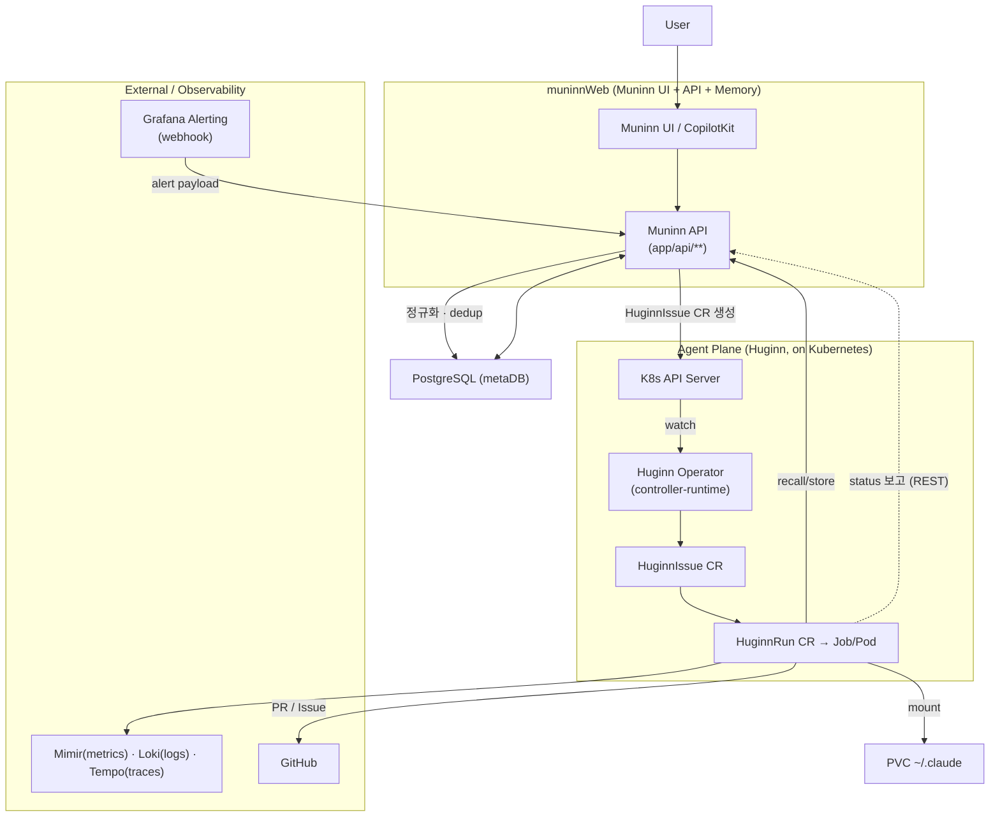

import { Callout } from 'nextra/components'

# 아키텍처

Muninn DevOps Agent Platform 은 관측(Observability) 신호를 입력으로 받아, 운영 문제를 자율적으로 진단하고 PR / Issue 로 해결안을 제출하는 이벤트 기반 자율 운영 플랫폼이다. 오딘의 두 까마귀에서 이름을 따온 두 평면으로 구성된다.

| 까마귀 | 평면 | 책임 |
|--------|------|------|
| **Huginn** (사고, *thought*) | Agent Plane | 이벤트를 받아 Claude Code 기반 에이전트를 실행한다. 로그·트레이스·메트릭을 조사하고, 코드를 읽고, PR/Issue 를 만든다. |
| **Muninn** (기억, *memory*) | Memory Plane + 콘솔 | 과거 사건에서 distill 한 지식(memory)을 저장/회상(recall)한다. 운영자가 보는 UI/API/metaDB 전체를 포함한다. |

핵심 한 줄: **"이벤트(webhook) 또는 운영자 대화(CopilotKit) → Huginn 이 조사하고 고친다 → Muninn 이 기억하고 제안한다."**

## 컴포넌트 역할

저장소는 독립적으로 빌드되는 3개 컴포넌트와 metaDB 로 이루어진다.

| 컴포넌트 | 역할 | 스택 | 상세 |
|----------|------|------|------|
| `huginnOperator/` | CRD 라이프사이클 소유. CR 을 watch/reconcile 하고 HuginnRun 마다 K8s Job 을 생성 | Go, kubebuilder / controller-runtime | [/components/operator](/components/operator) |
| `huginnAgentRuntime/` | 에이전트 실행 1회마다 도는 컨테이너 이미지. `claude_skill.sh` 엔트리 + `claude-agent-sdk` 루프 | Dockerfile + Python | [/components/agent-runtime](/components/agent-runtime) |
| `muninnWeb/` | 운영자 콘솔 + **Muninn API**(게이트웨이·메모리) + CopilotKit 코파일럿 | Next.js (App Router) | [/components/web](/components/web) |
| metaDB | application·event·run·memory 상태 저장. 메모리 recall 은 텍스트 검색(`to_tsvector`/`ts_rank_cd`) | PostgreSQL (외부 연결) | [/concepts/memory](/concepts/memory) |

<Callout type="info">
**Muninn API = muninnWeb.** 게이트웨이(이벤트/대화 수신, K8s CR 생성, 에이전트 보고 수신/status PATCH, 메모리 recall/store 중개)는 별도 서비스가 아니라 muninnWeb Next.js 앱의 `app/api/**` 가 겸한다. 설계서의 Redis·별도 Memory Service·pgvector 는 목표 설계이며 현 구현에는 없다 — dedup 은 활성 HuginnIssue CR 조회 + metaDB `inbound_event` 영속으로 동작한다.
</Callout>

## 이벤트 → 이슈 → 런 흐름

트리거는 두 경로이며 둘 다 1급이다 — Webhook(Grafana/Airflow/ArgoCD)과 운영자 대화(CopilotKit). 둘 다 Muninn API 를 거쳐 `HuginnIssue` CR 생성으로 수렴한다.

Operator 는 외부 webhook 수신자가 아니라 **K8s API watch 기반 controller** 다. 흐름을 풀면:

1. Grafana → Muninn API(`POST /hooks/{app}`)가 webhook 을 받는다.
2. API 가 payload 를 정규화하고 dedup 을 평가한다.
3. 신규/재발이면 API 가 K8s API Server 에 `HuginnIssue` CR 을 생성한다.
4. Operator 의 watch 가 이를 감지해 `HuginnRun`(→ Job/Pod)을 만든다.
5. Pod 가 `claude_skill.sh` → `claude-agent-sdk` 루프를 실행하고, recall(Muninn)·loki/tempo/mimir/github 으로 조사한 뒤 PR / GitHub Issue 를 만들고 기억을 저장한다.

즉 "API → Operator" 는 직접 RPC 가 아니라 **CR 생성을 통한 간접 트리거**다. Operator 는 Job 만 생성하며, 에이전트 프로세스와 Muninn API 가 진행 상황을 `HuginnRun.status` 에 되써 보고한다.

## CR 네이밍 규칙

API 그룹은 `muninn.io/v1beta1`, Kind 는 세 가지다.

| Kind | 의미 |
|------|------|
| `HuginnAgent` | 운영 대상 앱 1개 (영속적 에이전트 정의, 도메인상 "Application") |
| `HuginnIssue` | 이벤트 1건 |
| `HuginnRun` | 실행 1회 (retry/replay 시 run 이 늘어난다) |

- 아키텍처 그림의 오타 `huggin`/`hugginSession` 은 노르드 신화 정식 철자인 **Huginn** 으로 정규화한다(짝이 되는 **Muninn** 과 철자 일관성). 오타 철자는 쓰지 않는다.
- 이벤트 CR 은 `HuginnSession` 이 **아니라** `HuginnIssue` 다 — Claude Agent SDK 의 `session`(대화 transcript)과의 혼동을 피하기 위해 개명했다.
- 다이어그램 원본은 저장소 루트의 drawio 파일이며, 위 PNG 는 렌더 스냅샷이다.

CRD 필드 상세는 [/concepts/crds](/concepts/crds), Run 상태 모델과 수명주기는 [/concepts/run-lifecycle](/concepts/run-lifecycle) 에서 다룬다.

## 더 읽기

- 전체 설계서(목표 설계 + 구현 현황): [/design/muninn-devops-agent-platform](/design/muninn-devops-agent-platform)
- Operator 시맨틱: [/design/operator-design](/design/operator-design)
- 대화형 위임(코파일럿 오케스트레이션): [/design/muninn-goal-conversational-delegation](/design/muninn-goal-conversational-delegation)
- 원문: [docs/design/muninn-devops-agent-platform.md](https://github.com/KimSoungRyoul/muninn/blob/main/docs/design/muninn-devops-agent-platform.md)
