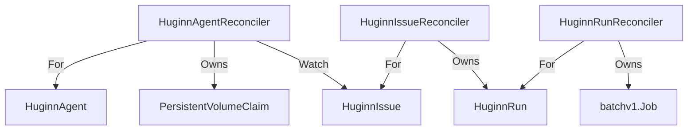

import { Callout } from 'nextra/components'

# huginnOperator

CRD 라이프사이클을 소유하는 Kubernetes 오퍼레이터. Go + kubebuilder(controller-runtime)로 구현되며, `muninn.io/v1beta1` 그룹의 CRD 3종(`HuginnAgent` / `HuginnIssue` / `HuginnRun`)에 컨트롤러 3개와 `HuginnAgent` ValidatingWebhook 1개를 둔다.

상세 시맨틱(재시도 모델, status 소유권, 취소 전파 등)은 [/design/operator-design](/design/operator-design)이 source of truth 다. 코드 주석이 해당 문서의 섹션 번호(`§2.2`, `§5.1` 등)를 인용한다.

## 역할

- `HuginnAgent`: webhookUrl 발급, 앱별 PVC(`~/.claude`) 보장, ServiceAccount ensure(비소유), `status.activeIssues` 집계
- `HuginnIssue`: `retryPolicy.maxRuns` 한도 내에서 attempt 별 `HuginnRun` 생성/재시도, run phase 집계 → issue phase
- `HuginnRun`: Job 생성(env/volume 주입), Job 상태 → `status.phase` 매핑, `spec.suspend=true` 시 Job 삭제 후 `Cancelled` 전이

## 컨트롤러 watch 토폴로지



- `ServiceAccount`(`huginn-agent`)는 ensure 하되 Owns 하지 않는다 — namespace 공용 SA 라 Agent 삭제 시 같이 GC 되면 다른 Run/Agent 가 깨진다.
- reconcile 성능을 위해 `HuginnIssue.spec.agentRef`, `HuginnRun.spec.issueRef` 에 field indexer 를 건다.

## 재시도는 pod 레벨이 아니다

Job 은 `backoffLimit=0` 으로 생성된다(Run 1개 = attempt 1개 = Job 1개). 에이전트 실행은 PR/Issue/메모리 저장 등 부작용이 있어 non-idempotent 이므로 pod 재시작은 부적합하다. 재시도는 `HuginnIssue` 컨트롤러가 새 attempt `HuginnRun` 을 만드는 방식이며, `retryPolicy.maxRuns` 가 Run 총개수 상한이고 backoff 는 재시도 간 `RequeueAfter` 로 구현된다.

## JobTemplate 이 슬림 subset 인 이유

`HuginnRun.spec.jobTemplate` 은 전체 `corev1.PodSpec` 이 아니라 큐레이팅된 필드 subset(image/command/env/resources/serviceAccountName/claudePVCName)만 담는다. 전체 `corev1.PodSpec` 을 넣으면 CRD OpenAPI 스키마(약 590KB)가 client-side-apply 의 256KB 어노테이션 한계를 넘기 때문이다. 덕분에 일반 `kubectl apply` 로 CRD 설치가 가능하다(server-side apply 불요).

- `buildJobTemplate`(helpers.go): Agent + Issue 정보로 슬림 recipe 를 채운다
- `expandPodSpec`(huginnrun_controller.go): 고정 필드(`restartPolicy=Never`, 컨테이너 이름, `~/.claude` 마운트, non-root securityContext)를 더해 실제 PodSpec 으로 확장한다

## status 는 merge-patch 만 쓴다

`HuginnRun.status` 는 writer 가 셋이다([/design/operator-design](/design/operator-design) §2.2):

| writer | 소유 필드 |
|--------|-----------|
| Operator | `phase` / `startedAt` / `finishedAt` / `durationSeconds` / `jobName` / caps / `conditions` |
| Agent→API | `step` / `cost` / `tokens` / `recalledMemoryIds` / `output` |
| API | `AwaitingApproval` 전이 + `approval` |

<Callout type="info">
오퍼레이터는 다른 writer 의 필드를 덮어쓰지 않도록 status 를 `r.Status().Patch(ctx, run, client.MergeFrom(base))` 로만 쓴다 — 전체 update 금지. muninnWeb 의 `lib/k8s.ts` 도 같은 이유로 merge-patch 를 쓴다.
</Callout>

승인 흐름에서도 마찬가지다: Muninn API 는 `approval.state=Approved` 만 쓰고 `phase` 는 건드리지 않으며, Operator 가 다음 reconcile 에서 이를 관측하고 `phase` 를 `Running` 으로 복귀시킨다. 두 writer 경합은 `MergeFromWithOptimisticLock` 으로 409 → requeue 처리한다.

## 개발 명령

```bash
cd huginnOperator

make manifests generate    # api/*_types.go 나 +kubebuilder 마커 수정 후 필수
make run                   # 로컬 실행 (ENABLE_WEBHOOKS=false)

# 순수 단위 테스트 (envtest 불필요)
go test ./internal/controller/ -run TestBuildJobTemplate -count=1

# kind + CRD + agent-runtime 이미지 적재 + operator(host 에서) 실행
make run-kind CONTAINER_TOOL=podman
# 그다음 다른 셸에서 — 인증 Secret + 예제 CR 적용 (ns ns-huginn-e2e):
kubectl -n ns-huginn-e2e create secret generic agent-secrets \
  --from-literal=claude-code-oauth-token="$CLAUDE_CODE_OAUTH_TOKEN"
kubectl apply -f ../huginnAgentRuntime/examples/kind-e2e.yaml

make test-e2e              # 격리된 e2e (별도 클러스터 huginnoperator-test-e2e; CONTAINER_TOOL 무시)
```

<Callout type="warning">
operator 타깃은 `CONTAINER_TOOL=docker` 가 기본이다. root/web/runtime Makefile 은 podman 이 기본이므로 operator 타깃엔 `CONTAINER_TOOL=podman` 을 명시하라. 또한 kubebuilder 생성 파일(`config/crd/bases/*`, `config/rbac/role.yaml`, `**/zz_generated.*`, `PROJECT`)은 직접 수정하지 말고 `make manifests generate` 로 재생성한다.
</Callout>

전체 kubebuilder 타깃은 `make help` 참고. 예제 CR 은 [/reference/crd-examples](/reference/crd-examples), 소스는 [huginnOperator/](https://github.com/KimSoungRyoul/muninn/blob/main/huginnOperator/README.md) 참고.
