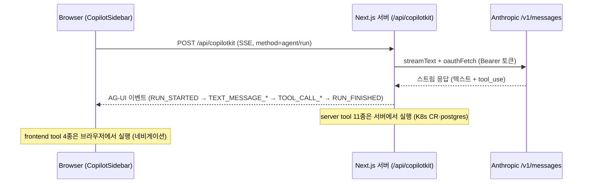

import { Callout } from 'nextra/components'

# muninnWeb

오퍼레이터 콘솔 + Muninn API (프로토타입). Next.js(App Router) + pnpm, 포트 3030.

## Dual-mode: 게이트웨이 + 메모리 + 콘솔

`app/api/**` 라우트는 배선되면 실제 동작을 한다:

- **게이트웨이**: `HuginnIssue`/`HuginnRun` CR 생성·패치 — `@kubernetes/client-node`, `lib/k8s.ts`. status 패치는 오퍼레이터와 같은 이유로 merge-patch 만 쓴다([/components/operator](/components/operator) 참고).
- **메모리**: 외부 postgres + Drizzle 로 메모리 저장·recall — `lib/db.ts`, 스키마 `lib/schema.ts`.

라우트는 `k8sEnabled()` / `dbEnabled()` 로 분기하고, 아니면 `lib/data.ts`(`HM_DATA`) mock 으로 폴백한다 — 마이그레이션 진행 중(약 22개 라우트/컴포넌트가 아직 `lib/data.ts` 를 import).

## 메모리 저장소 (postgres + Drizzle)

- **텍스트 검색**은 `to_tsvector` / `ts_rank_cd` 기반이며 임베딩/pgvector 가 없다 → 아무 postgres/CNPG 이미지나 가능.
- DB 는 `DATABASE_URL` 로 외부 연결. 권장 프로비저닝은 CloudNativePG(`deploy/quickstart`) — [/deployment/quickstart](/deployment/quickstart) 참고.
- `ensureSchema()` 가 `drizzle/` 폴더에서 Drizzle `migrate()` 를 멱등하게 실행한다. 이 폴더는 런타임에 포함되어야 한다(Dockerfile 에서 복사).

## CopilotKit 코파일럿 요청 흐름

코파일럿은 **서버 도구**(`defineTool`)를 통한 대화형 오케스트레이터이고, 내비게이션은 프론트엔드 도구(`useFrontendTool`)다. 오케스트레이션 흐름은 [/design/muninn-goal-conversational-delegation](/design/muninn-goal-conversational-delegation) 참고.



- **server tool(데이터/상태, 11종)**: `list_runs`, `recall_memory`, `delegate_incident` 등 — `lib/copilot-tools.ts` 의 `defineTool` 로 정의되어 서버에서 실행되며 `lib/incidents.ts` / `lib/db.ts` / `lib/k8s.ts` 를 경유해 실 K8s CR·postgres 를 만진다.
- **frontend tool(네비게이션, 4종)**: `open_app`, `open_run`, `go_to`, `switch_workspace` — `components/muninn-copilot.tsx` 의 `useFrontendTool` 로 브라우저에서 실행(라우팅).
- **OAuth 토큰은 서버 밖으로 안 나간다**: `lib/copilot-anthropic.ts` 의 `oauthFetch` 가 서버에서 `x-api-key` 를 제거하고 `Authorization: Bearer` + `anthropic-beta: oauth-2025-04-20` 헤더로 교체한다. 토큰이 클라이언트로 전달되지 않는다.

<Callout type="info">
승인/거절은 코파일럿이 하지 않는다. `approve_run` / `reject_run` 은 server tool 에서 의도적으로 제거됐다. 운영자 승인은 콘솔 전용 라우트(`/api/runs/[id]/approve|reject`) + 콘솔 UI 로만 가능하며, 코파일럿은 `open_run` 으로 안내만 한다.
</Callout>

전체 경로·소스 파일 매핑은 [muninnWeb/docs/copilotkit-request-flow.md](https://github.com/KimSoungRyoul/muninn/blob/main/muninnWeb/docs/copilotkit-request-flow.md) 참고.

## 모델 / 자격

- 기본 모델: `claude-haiku-4-5-20251001`. `COPILOT_MODEL` 환경변수로 override.
- 자격은 env(Secret)-only: `CLAUDE_CODE_OAUTH_TOKEN`(우선) 또는 `ANTHROPIC_API_KEY` 중 하나 필요. 자격증명을 웹 mock 데이터에 절대 넣지 마라.

## 개발 명령

```bash
cd muninnWeb
make dev        # pnpm dev, 포트 3030
```

<Callout type="warning">
`make dev` 실행 중에 `make build` 를 돌리지 마라 — `.next` 가 손상된다.
</Callout>

런타임/에이전트 등록 확인:

```bash
curl -X POST http://localhost:3030/api/copilotkit \
  -H 'content-type: application/json' --data '{"method":"info"}'
```
