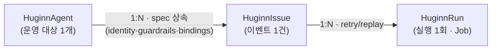
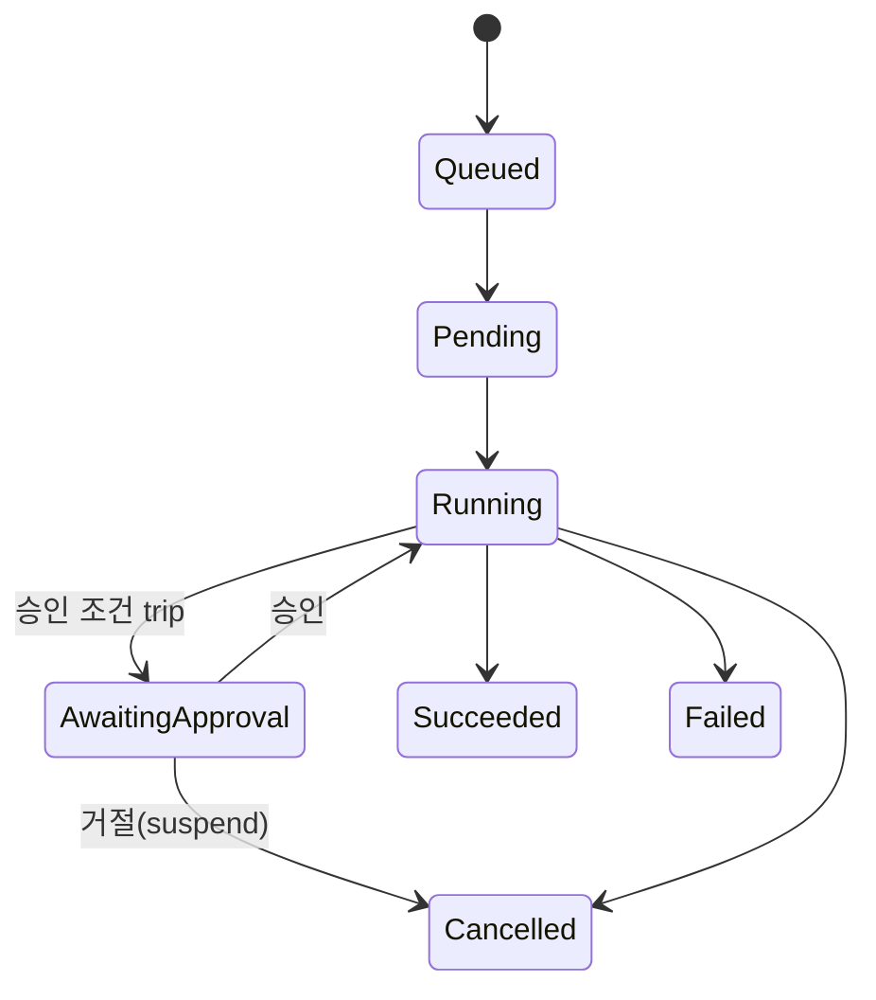

import { Callout } from 'nextra/components'

# CRD 모델

Muninn 플랫폼의 모든 실행 상태는 API 그룹 `muninn.io/v1beta1` 의 CRD 3종으로 표현된다.
이벤트 CR 의 Kind 는 Claude Agent SDK 의 "session"(대화 transcript)과의 혼동을 피해
`HuginnSession` 이 아니라 **`HuginnIssue`** 다.

| Kind | 역할 | 단위 |
|------|------|------|
| `HuginnAgent` | 관리 대상 앱(도메인상 "Application")의 영속적 에이전트 정의 | 운영 대상 1개 = CR 1개 |
| `HuginnIssue` | 정규화된 이벤트(장애/알림) 1건 | 이벤트 1건 = CR 1개 |
| `HuginnRun` | 이슈 내부의 실제 에이전트 실행 1회 (K8s Job 으로 실행) | attempt 1회 = CR 1개 |

소유 관계는 1:N 이며 `ownerReferences` 로 cascade GC 된다.

## HuginnAgent

운영 대상(추론 서버, 배치 DAG 등) 1개를 지키는 에이전트 정의. 콘솔의 "새 Application 등록"
위저드가 이 spec 으로 직렬화된다.

핵심 spec 필드:

- `spec.workspaceId` — 1급 필드(required, immutable). **`metadata.namespace` 와 동일해야 한다**
  (workspace = namespace 단일 진실원천). ValidatingWebhook 과 CEL 이 이중 검증하고,
  defaulting webhook 이 보조 라벨 `muninn.io/workspace` 를 동기화한다.
- `spec.kind` — `triton` / `fastapi` / `airflow` / `other` (배포 바인딩 자동 결정의 UX 힌트).
- `spec.output` — `pull_request` 또는 `github_issue` (에이전트 결과 형식).
- `spec.source` — GitHub 연결. `repo`, `pr.draft: true`(강제), `pr.approvalTriggers`(승인 필수
  조건 정책), `secretRef`(fine-grained PAT Secret — 키 `token`).
- `spec.trigger.severityThreshold` — 이 임계 미만 alert 는 게이트웨이가 drop.
- `spec.guardrails` — `maxIterations`(SDK `max_turns`), `maxCostUsd`(SDK `max_budget_usd`),
  `dailyRunCap`.
- `spec.bindings` — 에이전트가 사용할 Platform Tool(loki/tempo/metrics/argocd/harbor 등) 바인딩.
  모든 Issue 의 기본값 source.
- `spec.identity` — 관측 신호와 워크로드의 매핑(`otelServiceName`, `k8sNamespace`, `k8sLabels`).
- `spec.agent` — `runtime`, `soulRef`(SOUL.md ConfigMap), `image`(agent-runtime 이미지).

status 에는 Operator 가 발급하는 `webhookUrl`, reconcile 주기마다 계산되는 `activeIssues`,
표준 `conditions[]` 가 있다.

## HuginnIssue

**이벤트 페이로드 1건당 1개.** Muninn API(muninnWeb)가 webhook 정규화·dedup 통과 후 생성하고,
Operator 의 watch 가 감지한다.

- `spec.agentRef` — 부모 `HuginnAgent` 이름.
- `spec.event` — 정규화 이벤트(`id`, `source`, `severity`, `fingerprint`, `title`,
  `receivedAt`, `payload`, `payloadSecretRef`). `payload` 는 정규화 요약 map,
  `payloadSecretRef` 는 원본 alert JSON 을 보존하는 Secret 이름이다.
  `source` 는 `grafana` / `airflow` / `argocd` / `manual`.
- `spec.goal` — 이 이벤트에서 도출된 에이전트 목표(이벤트 단위 불변 컨텍스트).
- `spec.inheritedGuardrails` / `spec.inheritedBindings` / `spec.identity` — `HuginnAgent` spec
  의 스냅샷 복사(상속).
- `spec.issuingUser` / `spec.userPrompt` — 대화형 위임(manual) 경로에서만 채워지는 provenance.
- `spec.retryPolicy.maxRuns` — 이 이슈가 만들 수 있는 Run 총개수 상한(기본 3).
  **Job `backoffLimit` 으로 매핑하지 않는다** — 자세한 계약은 [실행 라이프사이클](/concepts/run-lifecycle).

status: `phase`, `runRefs[]`, `dedupCount`(같은 fingerprint 누적), `outcome`, `approval`,
`conditions[]`.

## HuginnRun

이슈 내부의 실제 실행 1회. Operator 가 이 CR 에 대응하는 K8s Job(→ Pod)을 만들고,
retry 마다 새 Run 이 생성된다.

- `spec.issueRef`, `spec.attempt` — 부모 이슈와 attempt 번호.
- `spec.timeoutSeconds`(기본 3600) — Job `activeDeadlineSeconds` 로 위임.
- `spec.ttlSecondsAfterFinished`(기본 86400) — Job `ttlSecondsAfterFinished` 로 위임.
- `spec.suspend` — `true` 면 Operator 가 Job 을 삭제하고 `phase=Cancelled` 로 전이
  (취소/승인 거절 전파 경로).
- `spec.jobTemplate` — 전체 PodSpec 이 아니라 **큐레이팅된 슬림 실행 recipe**
  (`image`, `command`, `serviceAccountName`, `claudePVCName`, `resources`, `env`).
  전체 `corev1.PodSpec` 을 임베드하면 CRD OpenAPI 스키마가 256KB client-side-apply
  어노테이션 한계를 넘기 때문이다. Run 컨트롤러가 Job 생성 시 고정 필드
  (restartPolicy=Never, 컨테이너 이름, `~/.claude` 마운트, non-root securityContext)를
  더해 실제 PodSpec 으로 확장한다.

status: `phase`, `step`/`maxStep`, `cost`/`maxCostUsd`, `tokens`/`maxTokens`,
`startedAt`/`finishedAt`, `recalledMemoryIds[]`, `output`, `approval`, `conditions[]`.
`cost` 와 recall `score` 는 float 모호성 회피를 위해 CRD 타입이 string 이다.

## 상태 머신

`status.phase` 는 K8s 관례에 따라 PascalCase 를 쓰고, 표현 계층(UI/SQL)은 소문자를 쓴다
(Muninn API 가 변환).

| phase | 의미 |
|-------|------|
| `Queued` | Run CR 생성됨, Job 생성 대기 |
| `Pending` | Pod 생성됨, 컨테이너 시작 중 |
| `Running` | 에이전트 실행 중 |
| `AwaitingApproval` | Human-in-the-loop 승인 대기 |
| `Succeeded` | 완료(PR/Issue 발행) |
| `Failed` | 실패(guardrail/오류/타임아웃) |
| `Cancelled` | 사용자 취소/승인 거절 |

승인 **만료**는 `Cancelled` 로 전이하지 않는다 — 만료 후 approve/reject 호출이 차단되고, 에이전트가 자체 wall-clock timeout 으로 정상 중단하면 Job 종료가 관측되어 `Succeeded`/`Failed` 로 마감된다([실행 라이프사이클](/concepts/run-lifecycle) §5 참고).

## status 필드 소유권 — 3-writer 규칙

`HuginnRun.status` 는 세 writer 가 나눠 쓴다
([operator-design §2.2](/design/operator-design)). 충돌 방지를 위해 각 필드의 소유자가
고정돼 있다.

| 소유자 | 필드 |
|--------|------|
| **Operator** | `phase`(Job/Pod lifecycle 기반), `startedAt`, `finishedAt`, `durationSeconds`, `jobName`, caps(`maxStep`/`maxCostUsd`/`maxTokens` — 생성 시 1회 복사), `conditions`(전이 사유) |
| **Agent → API** | `step`, `cost`, `tokens`, `output`, `recalledMemoryIds` |
| **API (muninnWeb)** | `AwaitingApproval` 전이 + `approval` 객체 |

<Callout type="warning">
  **위반 금지 계약.** 두 writer 모두 status subresource 에 대해 **자기 소유 필드만
  merge-patch** 한다. Operator 는 `r.Status().Patch(ctx, run, client.MergeFrom(base))` 로만
  쓰고(전체 update 금지), muninnWeb 의 `lib/k8s.ts` 도 같은 이유로 merge-patch 를 쓴다.
  Operator 는 진행 메트릭(`step`/`cost` 등)을 절대 0 으로 덮어쓰지 않는다.
</Callout>

승인 흐름에서의 분업: API 는 `approval.state=Approved` 만 쓰고 `phase` 는 건드리지 않으며,
Operator 가 `AwaitingApproval` 상태에서 `Approved` 를 관측하면 `phase` 를 `Running` 으로
복귀시킨다. 자세한 흐름은 [실행 라이프사이클](/concepts/run-lifecycle).

## 전체 예제

각 CRD 의 주석 달린 전체 샘플 YAML 은 [CRD 예제](/reference/crd-examples) 또는 저장소의
[docs/design/examples/](https://github.com/KimSoungRyoul/muninn/tree/main/docs/design/examples)
를 참고하라. 권위 있는 스펙은
[muninn-devops-agent-platform.md §3](/design/muninn-devops-agent-platform) 이다.
