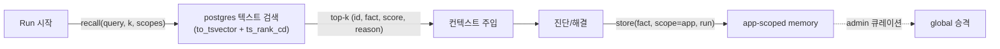

import { Callout } from 'nextra/components'

# Muninn 기억 시스템

Muninn(기억, *memory*)은 과거 사건에서 distill 한 지식을 저장하고 회상(recall)하는
**기억 평면(Memory Plane)** 이다. 에이전트는 조사를 시작하기 전에 관련 기억을 recall 해
컨텍스트로 주입받고, 실행이 끝나면 결과를 다시 기억으로 저장한다. 콘솔(Muninn UI)의 핵심
가치는 **에이전트가 무엇을 기억하고 어떻게 회상했는지를 운영자가 검수**하는 것이다.

## 기억의 종류와 스키마

기억(memory)은 1~2줄 Markdown 사실(fact) 단편이다.

- `scope: global` — 워크스페이스에서 공유되는 기억. 보통 admin 큐레이션을 거친
  `curated=true`.
- `scope: app` — 특정 Application 전용 기억. Run 종료 시 distill 되며 처음엔
  `curated=false`.
- 메타데이터: `tags[]`, `score`(0~1), `sourceRunId`(출처 Run), `workspace`(멀티테넌시
  경계 — recall/store 가 모두 workspace 로 필터).

저장소는 muninnWeb 이 `DATABASE_URL` 로 연결하는 **외부 postgres**(Drizzle ORM,
스키마는 [lib/schema.ts](https://github.com/KimSoungRyoul/muninn/blob/main/muninnWeb/lib/schema.ts))다.
함께 쓰는 테이블:

| 테이블 | 용도 |
|--------|------|
| `memory` | 기억 본문(fact, scope, tags, score, curated, source_run_id) |
| `memory_history` | fact 변경 이력(prev/new, changed_by, reason) — 버전/감사 |
| `incident_log` | 사건 이력(issue/run, issuing_user, goal, status, outcome, summary, cost) |

## Recall 방식 — postgres 텍스트 검색

<Callout type="info">
  **임베딩/pgvector 없음.** 현재 구현은 의미(벡터) 검색을 의도적으로 제거했다 — 외부
  임베딩 키·onnxruntime·pgvector 의존을 없애 어떤 postgres(CNPG stock 이미지 포함)에서도
  동작한다. 벡터/하이브리드 검색은 의미 검색이 정당화될 때 재도입하는 목표 설계다.
</Callout>

- 검색은 `to_tsvector('simple', fact)` + `websearch_to_tsquery('simple', query)` +
  `ts_rank_cd`(BM25 근사) 키워드 랭킹이다. 부분 매칭을 넓게 회수하기 위해 영숫자로
  sanitize 한 토큰들을 prefix(`:*`) + OR(`|`)로 묶은 `to_tsquery` 보조 쿼리도 함께 본다.
  인덱스는 `GIN(to_tsvector('simple', fact))`.
- query 가 없으면 `curated`, `score`, recency 상위로 정렬해 반환한다.
- 한국어+영어 키워드 매칭은 `simple` config 토큰화로 처리한다.
- scope 병합: `global` 과 `app` 각각의 top-k 를 합쳐 재정렬한다.

## 라이프사이클: recall → 실행 → store → 요약 → 이력

1. **위임 전 recall** — 관련 기억을 goal 컨텍스트에 seed 로 주입한다.
2. **실행** — 에이전트가 진단/PR 작업을 수행하고, 필요하면 추가 recall 을 한다
   (`POST /api/memories/recall`).
3. **완료 후 store** — 결과를 `scope=app` 기억으로 저장한다(`POST /api/memories`).
   global system prompt 는 "run 종료 시 해결한 문제를 1–2줄 Markdown 으로 정리"
   하도록 지시한다.
4. **요약/이력** — 결과를 1~2줄로 distill 해 `incident_log.summary` 에 남기고,
   fact 변경은 `memory_history` 에 기록된다.
5. **큐레이션** — admin 이 `curated=false` 기억을 검수해 global 로 승격한다.

## recalledMemoryIds 보고

에이전트는 어떤 기억을 회상했는지 `POST /api/runs/{id}/recall-report` 로 Muninn API 에
보고하고, API 가 `HuginnRun.status.recalledMemoryIds[]` 를 PATCH 한다(이 필드는
Operator 가 아니라 API 경유로 쓰인다 — [status 필드 소유권](/concepts/crds)).

각 항목은 `id` + `score` + `reason`(선택 근거, 예: "텍스트 ts_rank_cd 상위")이며,
`score` 는 float 모호성 회피를 위해 CRD 타입이 string 이다. 콘솔 Run 상세의
"Recall된 Memories" 카드가 이를 표시해 운영자가 회상 근거를 검수할 수 있다.

## 대화형 위임(/goal)과의 관계

운영자가 코파일럿으로 작업을 위임하는 경로에서도 같은 기억 시스템이 쓰인다 —
코파일럿이 위임 직전 recall 로 기억을 seed 하고, 완료 후 store/summarize/이력 기록까지
오케스트레이션한다. 전체 흐름은
[대화형 위임 설계 (/goal)](/design/muninn-goal-conversational-delegation) 를 참고하라.

권위 있는 스펙: [muninn-devops-agent-platform.md §7](/design/muninn-devops-agent-platform)
(목표 설계 포함), 구현 컴포넌트는 [muninnWeb](/components/web).
