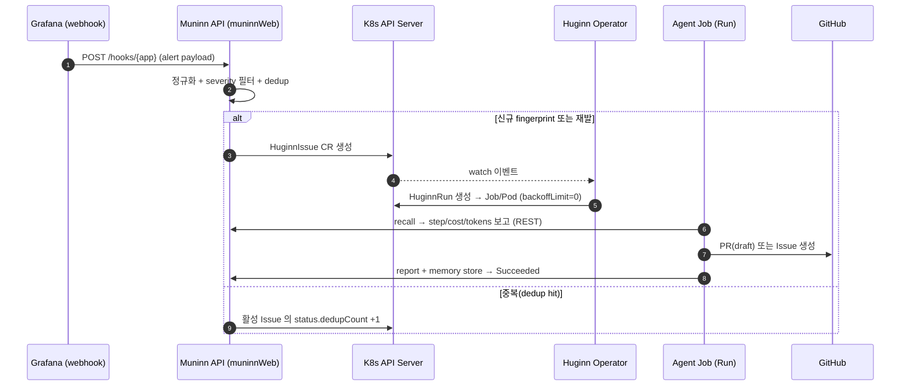

import { Callout } from 'nextra/components'

# 실행 라이프사이클

이벤트가 수신돼 에이전트 실행이 끝날 때까지의 전체 흐름이다. 핵심 규칙은
**1 Event = 1 Issue, 1 Issue = N Run**(retry/replay).

Operator 는 외부 webhook 수신자가 아니라 **K8s API watch 기반 controller** 다. Muninn API 가
`HuginnIssue` CR 을 생성하는 것이 곧 간접 트리거이며, 직접 RPC 는 없다.

## 1. 이벤트 수신과 정규화

트리거는 두 경로이고 둘 다 같은 `HuginnIssue` CR 로 수렴한다.

- **Webhook**: Grafana/Airflow/ArgoCD 가 `POST /hooks/{app}` 으로 alert 를 보낸다.
  `source` 는 `grafana`/`airflow`/`argocd`.
- **Manual(대화형 위임)**: 운영자가 CopilotKit 코파일럿으로 자연어 지시를 내리면
  `source=manual` 에 `issuingUser`/`userPrompt` provenance 가 채워진다 —
  [대화형 위임 설계](/design/muninn-goal-conversational-delegation).

Muninn API 는 payload 를 표준형(`id`, `source`, `severity`, `fingerprint`, `title`,
`receivedAt`, `payload`)으로 정규화하고, `severityThreshold` 미만 alert 는 즉시 drop 한다.
prompt injection 방어를 위해 텍스트 필드는 sanitize(길이 제한·제어문자 제거·Markdown
이스케이프)된다.

## 2. Dedup → 이슈 생성

- 수신 즉시 인입 이벤트를 metaDB `inbound_event` 테이블에 영속한다(감사·재처리).
- `muninn.io/event-fingerprint` 라벨로 같은 fingerprint 의 **활성** Issue
  (`phase` 가 `Pending`/`Running`/`AwaitingApproval`)를 조회한다.
  - 활성 Issue 가 있으면 새 Issue 를 만들지 않고 그 Issue 의 `status.dedupCount` 를 +1 한다.
  - 종료 상태(`Succeeded`/`Failed`/`Cancelled`)만 있으면 재발로 보고 새 Issue 를 생성한다.
- 생성되는 `HuginnIssue` 에는 부모 `HuginnAgent` 의 guardrails/bindings/identity 스냅샷이
  상속된다 — [CRD 모델](/concepts/crds).

## 3. 런 생성과 Job 실행

`HuginnIssue` 컨트롤러가 attempt 1 의 `HuginnRun` 을 만들고, `HuginnRun` 컨트롤러가
대응하는 K8s Job 을 생성한다. 타임아웃/정리는 Job 네이티브 필드로 위임한다:

| Run spec | Job 필드 |
|----------|----------|
| `timeoutSeconds`(기본 3600) | `activeDeadlineSeconds` |
| `ttlSecondsAfterFinished`(기본 86400) | `ttlSecondsAfterFinished` |
| (고정) | `backoffLimit: 0` |

Job/Pod 상태는 Operator 가 `Run.status.phase` 로 매핑한다:

| 관찰(Job/Pod) | Run.phase |
|---------------|-----------|
| Run 생성, Job 미생성 | `Queued` |
| Job 생성, Pod Pending | `Pending` |
| Pod Running | `Running` |
| (API) request-approval | `AwaitingApproval` |
| Job Complete | `Succeeded` |
| Job Failed / deadline 초과 | `Failed` |
| `spec.suspend=true` | `Cancelled` |

## 4. 재시도 계약 — pod 재시작이 아니라 새 attempt Run

<Callout type="warning">
  **재시도는 pod 레벨이 아니다.** Job 은 항상 `backoffLimit=0` 으로 생성된다.
  에이전트 실행은 non-idempotent(PR/Issue 발행, 메모리 저장 부작용)라서 Pod 를 무지성
  재시작하면 중복 PR 위험이 있다. pod restart 를 절대 다시 켜지 마라.
</Callout>

- **Run = 1 attempt = `backoffLimit=0` 인 Job 1개.**
- 직전 Run 이 `Failed` 면 `HuginnIssue` 컨트롤러가 *새 attempt* `HuginnRun`(attempt N+1)을
  생성한다. 상한은 `spec.retryPolicy.maxRuns`(기본 3).
- `backoff: exponential` 은 Issue 컨트롤러가 재시도 간 `RequeueAfter`(예: 30s·60s·120s)로
  구현한다. Job 네이티브 backoff 가 아니다.
- attempt 마다 독립된 transcript·cost·token 회계를 가지므로 Run CR 분리가 자연스럽다.
- 멱등 가드(에이전트 측 규약): PR 생성 전 `huginn` 라벨이 붙은 열린 PR 존재 여부를 확인한다.

근거와 정정 이력은 [operator-design §2.1](/design/operator-design).

## 5. 승인(AwaitingApproval) 흐름

`output=pull_request` 에서 위험 조건(`approvalTriggers`: dependency 변경, 큰 diff,
workflow 파일 변경, guardrail 한도 근접)이 충족되면 human-in-the-loop 승인을 거친다.
`output=github_issue` 는 승인 없이 자동 발행된다.

1. 에이전트(runner.py)가 위험 작업 직전 `POST /runs/{id}/report` 에 승인 요청을 보낸다.
2. **Muninn API 가** Run 을 `phase=AwaitingApproval`, `approval.state=Pending` 으로 전이하고
   `expiresAt`(기본 90분, `MUNINN_APPROVAL_TTL_MINUTES`)을 기록한다 — 이 전이와 `approval`
   은 API 소유 필드다([3-writer 규칙](/concepts/crds)).
3. 승인 대기 중에도 Pod 는 살아 있고, 에이전트가 `GET /api/runs/{id}` 를 폴링한다.
4. **승인**: 콘솔이 `approval.state=Approved` 만 패치하고 `phase` 는 건드리지 않는다.
   Operator 가 다음 reconcile 에서 이를 관측하고 `phase` 를 `Running` 으로 복귀시킨다.
5. **거절**: `approval.state=Rejected` + `spec.suspend=true` 패치 → Operator 가 Job 을
   삭제하고 `phase=Cancelled`. 이벤트는 수동 재트리거 가능.
6. **만료**: `expiresAt` 초과 후의 approve/reject 호출은 차단된다. 에이전트는 자체
   wall-clock timeout(기본 90분)으로 정상 중단한다.

승인/거절은 **콘솔 전용**(`/api/runs/[id]/approve|reject`)이다 — CopilotKit 코파일럿은
승인/거절 server tool 을 갖지 않는다(자율 승인 게이트).

## 6. 보고와 완료

실행 중·종료 시 에이전트는 Muninn API 로 보고한다:

- `POST /runs/{id}/report` — `step`/`cost`/`tokens`/`output`(Agent→API 소유 필드만 PATCH).
- `POST /runs/{id}/recall-report` — `recalledMemoryIds[]`(id, score, reason).
- 완료 시 결과를 기억으로 저장한다 — [기억 시스템](/concepts/memory).

`finishedAt` 과 `durationSeconds` 는 Operator 가 Job 종료를 관측해 기록한다. Run/Issue 는
`ownerReferences` 로 cascade GC 되며, 전이 사유(거절/타임아웃/비용초과)는 `conditions[]`
에 남는다.

전체 시퀀스의 권위 있는 스펙은
[muninn-devops-agent-platform.md §4](/design/muninn-devops-agent-platform),
Job/재시도 시맨틱은 [operator-design](/design/operator-design),
컨트롤러 구현은 [Operator 컴포넌트](/components/operator) 를 참고하라.
