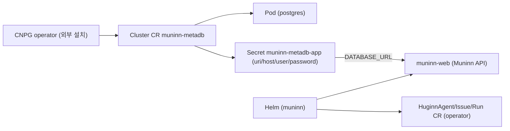

import { Callout } from 'nextra/components'

# Quickstart — CloudNativePG metaDB + Helm

Muninn 플랫폼을 kind/클러스터에 빠르게 올리는 경로다. **metaDB(PostgreSQL, 텍스트 검색 전용)는 Helm chart 가 번들하지 않는다** — 운영(HA·백업·업그레이드)을 [CloudNativePG(CNPG)](https://cloudnative-pg.io/) operator 에 위임하고, chart 는 그 연결 Secret 만 가리킨다. chart 가 가벼워지고 DB 수명주기가 분리된다.

<Callout type="warning">
operator/web 이미지는 아직 CI 미발행이다. 아래 흐름을 기본 이미지 값 그대로 따라하면 operator/web 이 `ImagePullBackOff` 로 멈춘다. 가장 쉬운 경로는 루트 `make run-local` — kind 생성·이미지 3종 빌드/적재·metaDB·helm 설치를 한 번에 한다. 아래 CNPG quickstart 를 직접 따라갈 때는 4단계의 이미지 로컬 빌드·`kind load`·`--set *.image.*` override 를 반드시 함께 수행하라([Helm 차트](/deployment/helm)의 "로컬 이미지로 kind 설치" 참고).
</Callout>

전체 구성은 다음과 같다.



<Callout type="info">
검색은 **postgres 텍스트 검색**(to_tsvector/ts_rank_cd)만 쓴다 — pgvector·확장 불필요. 어떤 CNPG operand 이미지든 그대로 동작한다. (의미/시맨틱 검색은 후속에서 정당화될 때 재도입.)
</Callout>

명령은 저장소 루트에서 실행한다.

## 1) CNPG operator 설치 (클러스터 1회)

```bash
kubectl apply --server-side -f \
  https://raw.githubusercontent.com/cloudnative-pg/cloudnative-pg/release-1.25/releases/cnpg-1.25.0.yaml
kubectl -n cnpg-system rollout status deploy/cnpg-controller-manager
```

## 2) metaDB Cluster 생성

[deploy/quickstart/metadb-cnpg.yaml](https://github.com/KimSoungRyoul/muninn/blob/main/deploy/quickstart/metadb-cnpg.yaml) 을 적용하면 CNPG 가 postgres Pod 과 연결 Secret 을 만든다.

```bash
kubectl create namespace muninn 2>/dev/null || true
kubectl -n muninn apply -f deploy/quickstart/metadb-cnpg.yaml
kubectl -n muninn wait --for=condition=Ready cluster/muninn-metadb --timeout=300s
# CNPG 가 만든 연결 Secret(키: uri/host/port/user/password/dbname)
kubectl -n muninn get secret muninn-metadb-app -o jsonpath='{.data.uri}' | base64 -d; echo
```

## 3) 자격 Secret 생성 (커밋 금지 — env(Secret)-only)

토큰/키는 환경변수에서 읽어 Secret 으로만 주입한다. 매니페스트·values 에 절대 커밋하지 않는다.

```bash
kubectl -n muninn create secret generic muninn-web-secrets \
  --from-literal=claude-code-oauth-token="$CLAUDE_CODE_OAUTH_TOKEN"
# agent Job 도 동일 자격이 필요하면 agent-secrets 도 생성(operator 가 주입).
kubectl -n muninn create secret generic agent-secrets \
  --from-literal=claude-code-oauth-token="$CLAUDE_CODE_OAUTH_TOKEN"
```

## 4) 이미지 빌드 + load (CI 미발행이므로 필수)

operator/web 이미지를 로컬 빌드해 kind 노드에 적재한다. 완전수식 이름(`ghcr.io/kimsoungryoul/muninn/*`)으로 빌드해 podman 의 `localhost/` 접두 문제를 피한다.

```bash
make -C huginnOperator image CONTAINER_TOOL=podman IMG=ghcr.io/kimsoungryoul/muninn/huginn-operator:dev
make -C muninnWeb       image CONTAINER_TOOL=podman IMG=ghcr.io/kimsoungryoul/muninn/muninn-web:dev
for img in huginn-operator muninn-web; do
  podman save ghcr.io/kimsoungryoul/muninn/$img:dev -o /tmp/$img.tar
  KIND_EXPERIMENTAL_PROVIDER=podman kind load image-archive /tmp/$img.tar --name <cluster>
done
```

## 5) Helm 설치 (web 을 CNPG Secret 에 배선 + 로컬 이미지 override)

```bash
helm upgrade --install muninn deploy/helm/muninn -n muninn \
  --set metaDb.enabled=true \
  --set metaDb.existingSecret=muninn-metadb-app \
  --set web.auth.existingSecret=muninn-web-secrets \
  --set operator.image.repository=ghcr.io/kimsoungryoul/muninn/huginn-operator \
  --set operator.image.tag=dev --set operator.image.pullPolicy=IfNotPresent \
  --set web.image.tag=dev --set web.image.pullPolicy=IfNotPresent
```

`metaDb.enabled=true` 면 chart 가 muninn-web 에 `DATABASE_URL`(= CNPG Secret 의 `uri`)을 주입하고, muninn-web 이 K8s API(HuginnIssue 생성·HuginnRun 보고)를 호출하도록 **ServiceAccount + RBAC** 를 만든다. operator 에는 `MUNINN_API_ENDPOINT`/`MUNINN_MEMORY_ENDPOINT`(= muninn-web Service)가 주입돼, agent Job 이 muninn-web 으로 보고/메모리 저장을 한다.

## 대안 — 경량 (kind QA, operator 불필요)

CNPG 없이 단일 postgres 로 빠르게 보려면 [muninnWeb/examples/kind-goal-e2e.yaml](https://github.com/KimSoungRyoul/muninn/blob/main/muninnWeb/examples/kind-goal-e2e.yaml) 을 쓴다 — bare `postgres:16` Deployment + SA/RBAC 구성이며, 텍스트 검색만 쓰므로 pgvector operand 가 불필요하다. 운영/quickstart 의 권장 경로는 위 CNPG 방식이다.

## 검증

```bash
kubectl -n muninn port-forward svc/muninn-web 3030:3030
# 코파일럿: "어떤 App 에 장애 나고 대처 진행중?" / "...timeout 의심, 확인하고 fallback PR 만들어 검토받아"
kubectl -n muninn get cluster,huginnissue,huginnrun,job,pod
kubectl -n muninn exec -it muninn-metadb-1 -- psql -U muninn -d muninn -c 'select id,fact from memory limit 5;'
```

다음 단계는 [Helm 차트](/deployment/helm)의 values 표와 [CRD 개념](/concepts/crds), [muninnWeb 컴포넌트](/components/web) 문서를 참고하라.
